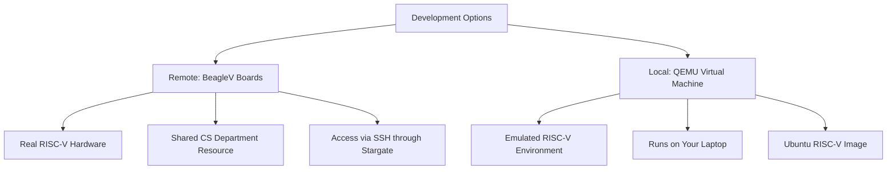
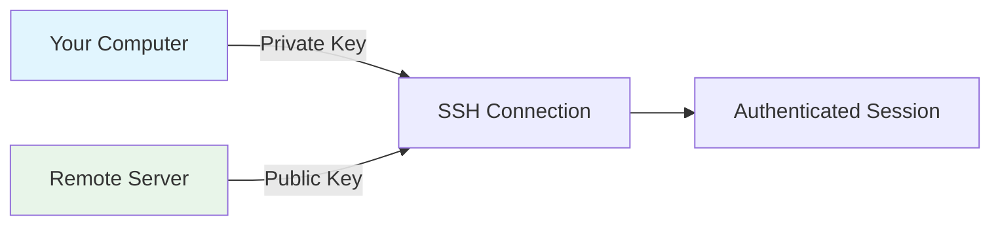

# Introduction to Development Environment

## Overview

This lecture introduces the CS 631 Systems Foundations course and establishes the development environment that will be used throughout the semester. Students will learn how to access both local and remote RISC-V development environments, configure SSH keys for secure passwordless authentication, and become familiar with essential command-line tools.

## Learning Objectives

- Understand the RISC-V development ecosystem used in CS 631
- Configure SSH keys for secure, passwordless access to remote systems
- Set up a local RISC-V virtual machine using QEMU
- Navigate the command line and use a console-based text editor
- Access GitHub repositories using SSH authentication

## Prerequisites

- Basic familiarity with the command line (terminal)
- A GitHub account
- A computer running macOS, Linux, or Windows with WSL

---

## 1. Course Introduction

### Ice Breaker Activity

At the start of the course, students introduce themselves with:

1. **Name** - How you prefer to be called
2. **Where you grew up** - Geographic background
3. **Favorite editor**
4. **Favorite programming language**

This activity helps build community and establishes a collaborative learning environment.

### Course Focus

CS 631 Systems Foundations focuses on understanding computer systems at a fundamental level. The course uses the RISC-V instruction set architecture (ISA) as a vehicle for learning about:

- How programs are compiled and executed
- Memory organization and management
- Low-level programming in C and assembly
- System interfaces and operating system concepts

---

## 2. Development Environment Overview

### RISC-V Architecture

RISC-V is an open-source instruction set architecture that has gained significant adoption in academia and industry. In this course, we work with RISC-V because:

- **Open and accessible**: No licensing restrictions for learning
- **Clean design**: Modern ISA without legacy cruft
- **Industry relevant**: Growing adoption in embedded systems and beyond

### Development Options

Students have two primary ways to develop RISC-V code:



#### Option 1: Remote BeagleV Machines

The CS Department has 5 BeagleV-Ahead boards - real RISC-V hardware that students can access remotely. These boards run Linux and provide an authentic RISC-V development experience.

**BeagleV-Ahead Specifications:**
- T-Head TH1520 RISC-V processor
- Quad-core, 64-bit
- Running Linux

#### Option 2: Local QEMU Virtual Machine

QEMU (Quick EMUlator) allows you to run a RISC-V virtual machine on your own computer. This provides:
- Development capability without network access
- Faster iteration for local testing
- A consistent environment across different host systems

---

## 3. Command Line Fundamentals

### Accessing the Terminal

The shell (command line) is essential for systems programming. Here's how to access it on different platforms:

| Platform | Application |
| --- | --- |
| macOS | Terminal.app or iTerm2 |
| Linux | Terminal application |
| Windows | Ubuntu WSL (recommended) or Git Bash |

### Shell Prompts

The shell prompt indicates where you type commands:

```
$     # Bash or sh prompt
%     # Zsh prompt (default on macOS)
```

### Essential Commands

Here are the most important commands you'll use frequently:

```
# Navigation
cd              # Change to home directory
cd /path/to/dir # Change to specific directory
pwd             # Print working directory
ls              # List files in current directory
ls -la          # List all files with details

# File operations
cp source dest  # Copy file
mv source dest  # Move or rename file
rm file         # Remove file (careful!)
mkdir dirname   # Create directory

# Viewing files
cat file        # Display file contents
less file       # Page through file contents
head file       # Show first 10 lines
tail file       # Show last 10 lines
```

---

## 4. SSH Configuration

### Understanding SSH Keys

SSH (Secure Shell) uses public-key cryptography for authentication. This is more secure than passwords and enables passwordless login.



**Key Concepts:**
- **Private Key**: Stays on your computer, never shared
- **Public Key**: Placed on servers you want to access
- **Passphrase**: Protects your private key (like a password for your password)

### Step-by-Step SSH Key Setup

#### Step 1: Create the SSH Key Pair

On your local computer, navigate to your `.ssh` directory and create a new key:

```
# Navigate to .ssh directory
cd
cd .ssh

# Generate a new Ed25519 key pair
ssh-keygen -t ed25519 -C "your_username@dons.usfca.edu" -f id_ed25519_cs631_2026s
```

When prompted for a passphrase, use a memorable sentence of English words. You'll need to enter this passphrase occasionally.

#### Step 2: Create SSH Config File

Create or edit `~/.ssh/config` with the following content:

```
IgnoreUnknown UseKeychain
UseKeychain yes

Host stargate
  HostName stargate.cs.usfca.edu
  AddKeysToAgent yes
  ForwardAgent yes
  IdentityFile ~/.ssh/id_ed25519_cs631_2026s
  User your_username
```

Replace `your_username` with your actual USF/CS username.

#### Step 3: Set File Permissions

SSH requires strict permissions on key files:

```
cd ~/.ssh
chmod 600 *
```

#### Step 4: Copy Public Key to Stargate

```
scp id_ed25519_cs631_2026s.pub stargate:.ssh
```

#### Step 5: Configure Stargate

SSH into stargate and add your public key to `authorized_keys`:

```
ssh stargate
cd .ssh
cat id_ed25519_cs631_2026s.pub >> authorized_keys
chmod 600 *
exit
```

#### Step 6: Test the Connection

```
# First login - will ask for passphrase
ssh stargate

# Exit and try again
exit
ssh stargate

# Second login - should not ask for passphrase
```

### Accessing BeagleV Machines

From stargate, you can access the BeagleV machines:

```
ssh beagle
```

This connects you to one of: beagle1, beagle2, beagle3, beagle4, or beagle5.

To enable SSH agent forwarding (so your GitHub key works on BeagleV), add to `~/.ssh/config` on stargate:

```
Host *
    ForwardAgent yes
```

### Direct ssh to BeagleV machines

**ON YOUR COMPUTER**

You can add the following to your `~/.ssh/config` so you can just type `ssh beagle` to get to a BeagleV machine:

```
Host beagle
  HostName beagle
  AddKeysToAgent yes
  ForwardAgent yes
  IdentityFile ~/.ssh/<your_private_key>
  User <your_username>
  ProxyCommand ssh stargate -W %h:%p
```

---

## 5. Local RISC-V VM Setup

### Installing QEMU

#### macOS (using Homebrew)

```
# Install Homebrew if not already installed
/bin/bash -c "$(curl -fsSL https://raw.githubusercontent.com/Homebrew/install/HEAD/install.sh)"

# Add Homebrew to PATH (add to ~/.zprofile)
export PATH=/opt/homebrew/bin:$PATH

# Install QEMU
brew install qemu
```

#### Ubuntu/Ubuntu-WSL

```
# Update system packages
sudo apt update
sudo apt upgrade
sudo apt full-upgrade

# Install QEMU
sudo apt install qemu qemu-system-misc
```

### Downloading and Running the RISC-V Image

```
# Create a directory for CS 631 work
mkdir cs631
cd cs631

# Download the Ubuntu RISC-V image
curl https://www.cs.usfca.edu/~benson/cs315/files/ubuntu-22.04-riscv.zip --output ubuntu-22.04-riscv.zip
unzip ubuntu-22.04-riscv.zip

# Start the VM
cd ubuntu-22.04-riscv
./start.sh
```

### VM Login Credentials

| Username | Password |
| --- | --- |
| ubuntu | goldengate |

### SSH into the Local VM

Instead of using the console, you can SSH into the running VM:

```
ssh -p 4444 ubuntu@localhost
```

### Creating Your Own User (Optional)

```
# Create a new user
sudo adduser your_username

# Grant sudo privileges
sudo adduser your_username sudo
```

### Setting Up SSH Keys for the Local VM

Add to your `~/.ssh/config` on your computer:

```
Host riscv
  HostName 127.0.0.1
  Port 4444
  AddKeysToAgent yes
  ForwardAgent yes
  IdentityFile ~/.ssh/id_ed25519_cs631_2026s
  User your_username
```

Then set up the keys in the VM:

```
# On the VM
ssh -p 4444 ubuntu@localhost
mkdir .ssh
chmod 700 .ssh
exit

# On your computer
cd ~/.ssh
scp -P 4444 id_ed25519_cs631_2026s.pub your_username@localhost:.ssh

# Back on the VM
ssh -p 4444 your_username@localhost
cd .ssh
cat id_ed25519_cs631_2026s.pub >> authorized_keys
chmod 600 *
exit
```

Now you can connect simply with:

```
ssh riscv
```

### Shutting Down the VM

Always shut down the VM cleanly:

```
sudo poweroff
```

---

## 6. GitHub SSH Access

### Configure SSH for GitHub

Add to `~/.ssh/config`:

```
Host github.com
  AddKeysToAgent yes
  ForwardAgent yes
  IdentityFile ~/.ssh/id_ed25519_cs631_2026s
  User your_username
```

### Add Your Public Key to GitHub

1. Go to <https://github.com/settings/keys>
2. Click "New SSH key"
3. Paste the contents of `~/.ssh/id_ed25519_cs631_2026s.pub`
4. Save the key

### Test GitHub Access

```
ssh -T git@github.com
```

Expected output:

```
Hi username! You've successfully authenticated, but GitHub does not provide shell access.
```

---

## 7. The Micro Text Editor

### Why Use a Console Editor?

When working on remote systems or in virtual machines, you need a text editor that runs in the terminal. The micro editor is recommended because it uses familiar keyboard shortcuts.

### Basic Micro Commands

```
micro filename      # Open file for editing

# Inside micro:
CTRL-Q              # Quit
CTRL-S              # Save
Shift-Arrow         # Select text
CTRL-C              # Copy selection
CTRL-X              # Cut selection
CTRL-V              # Paste selection
CTRL-F              # Find text
```

### Example: Editing a File

```
# Create and edit a simple C program
micro hello.c
```

Type your code, then press `CTRL-S` to save and `CTRL-Q` to quit.

---

## Key Concepts

| Concept | Description |
| --- | --- |
| RISC-V | Open-source instruction set architecture used in this course |
| SSH Keys | Public-key cryptography for secure, passwordless authentication |
| QEMU | Hardware emulator for running RISC-V VMs locally |
| Stargate | CS Department gateway server for accessing internal resources |
| BeagleV | Real RISC-V hardware boards available in the CS Department |
| Agent Forwarding | Allows your SSH keys to be used on intermediate servers |

---

## Practice Problems

### Problem 1: SSH Key Generation

**Question:** What is the purpose of the `-C` flag in the `ssh-keygen` command?

> **Show Solution**
>
> The `-C` flag adds a comment to the SSH key. This comment is typically your email address and helps identify the key when you have multiple keys. It's stored at the end of the public key file and has no effect on the cryptographic security of the key.
> Example:
> 
> ```
> ssh-keygen -t ed25519 -C "student@university.edu" -f my_key
> ```
> 
> The resulting public key will end with `student@university.edu`.

### Problem 2: File Permissions

**Question:** Why do we use `chmod 600` for SSH key files? What would happen if permissions were set to `644`?

> **Show Solution**
>
> `chmod 600` sets the file permissions to read/write for the owner only (no access for group or others).
> - `6` = read (4) + write (2) for owner
> - `0` = no permissions for group
> - `0` = no permissions for others
> If permissions were `644` (readable by everyone), SSH would refuse to use the private key because it's insecure. SSH requires that private keys are not accessible by other users on the system. You would see an error like:
> 
> ```
> @@@@@@@@@@@@@@@@@@@@@@@@@@@@@@@@@@@@@@@@@@@@@@@@@@@@@@@@@@@
> @         WARNING: UNPROTECTED PRIVATE KEY FILE!          @
> @@@@@@@@@@@@@@@@@@@@@@@@@@@@@@@@@@@@@@@@@@@@@@@@@@@@@@@@@@@
> Permissions 0644 for '/home/user/.ssh/id_ed25519' are too open.
> ```

### Problem 3: SSH Config

**Question:** Write an SSH config entry that allows you to type `ssh myserver` to connect to `server.example.com` on port 2222 using the username `admin` and key file `~/.ssh/server_key`.

> **Show Solution**
>
> Add the following to `~/.ssh/config`:
> 
> ```
> Host myserver
>   HostName server.example.com
>   Port 2222
>   User admin
>   IdentityFile ~/.ssh/server_key
>   AddKeysToAgent yes
> ```
> 
> Now `ssh myserver` will expand to:
> 
> ```
> ssh -p 2222 -i ~/.ssh/server_key admin@server.example.com
> ```

### Problem 4: QEMU Networking

**Question:** Why do we use `-p 4444` when SSHing into the local RISC-V VM?

> **Show Solution**
>
> QEMU is configured to forward port 4444 on the host (your computer) to port 22 (SSH) inside the VM. This is called port forwarding.
> Since port 22 on your computer might already be in use (if you're running an SSH server), QEMU uses a different port. When you run:
> 
> ```
> ssh -p 4444 ubuntu@localhost
> ```
> 
> The connection goes to:
> 1. Port 4444 on localhost (your computer)
> 2. QEMU intercepts this connection
> 3. QEMU forwards it to port 22 inside the VM
> 4. The SSH server in the VM receives the connection
> This technique allows multiple VMs to run simultaneously, each with different forwarded ports.

---

## Further Reading

- [RISC-V Foundation](https://riscv.org/) - Official RISC-V organization
- [QEMU Documentation](https://www.qemu.org/documentation/) - QEMU user manual
- [OpenSSH Manual](https://www.openssh.com/manual.html) - Comprehensive SSH documentation
- [Micro Editor](https://micro-editor.github.io/) - Micro editor homepage and documentation
- [BeagleV-Ahead](https://www.beagleboard.org/boards/beaglev-ahead) - Information about the BeagleV boards

---

## Summary

1. **Development Environment**: CS 631 uses RISC-V as the target architecture, with both real hardware (BeagleV) and emulated environments (QEMU) available for development.
2. **SSH Keys**: Public-key authentication is more secure than passwords and enables passwordless login. Always protect your private key and use a strong passphrase.
3. **Command Line Proficiency**: Systems programming requires comfort with the terminal. Learn essential commands and use a console-based editor like micro.
4. **Multiple Access Paths**: You can work locally with QEMU or remotely via stargate to the BeagleV machines. Having both options provides flexibility and redundancy.
5. **Git and GitHub**: SSH key authentication extends to GitHub, enabling secure repository access from all your development environments.