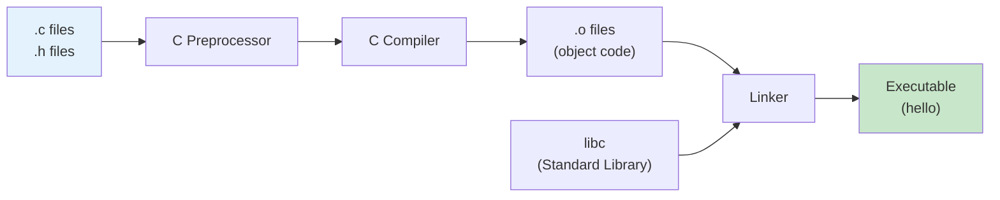
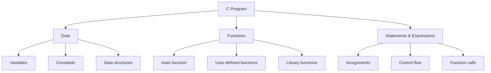
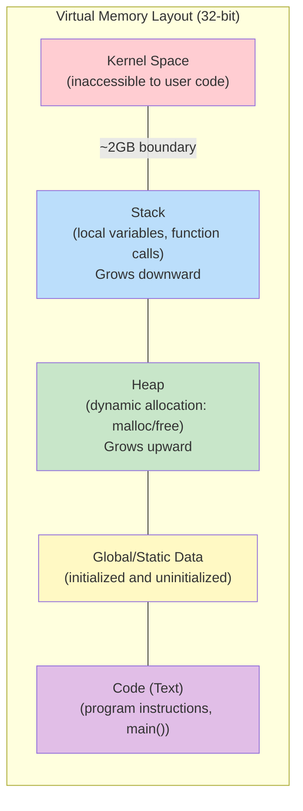
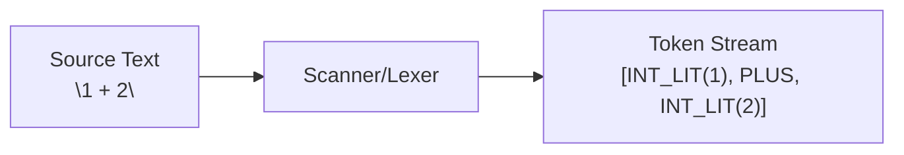

# C Programming and Scanning

## Overview

This lecture introduces the fundamentals of C programming and begins our exploration of lexical analysis (scanning). We cover the C compilation process, data types, memory organization, pointers, and the basics of building a scanner for the NTlang language. Understanding these concepts is essential for implementing the course projects.

## Learning Objectives

- Understand the C compilation pipeline from source to executable
- Identify and use C's native and composite data types
- Explain memory organization in C programs (stack, heap, global data)
- Work with pointers and understand memory addressing
- Implement a basic lexical scanner using EBNF grammar specifications

## Prerequisites

- Basic programming experience in any language
- Familiarity with the command line
- Development environment set up (from previous lecture)

---

## 1. C Programming Fundamentals

### The C Compilation Pipeline

C is a compiled language, meaning your source code must be transformed into machine code before it can execute. The `gcc` (GNU Compiler Collection) handles this process.



### Compilation Example

```
gcc -o hello hello.c
```

This single command actually performs multiple steps:

1. **Preprocessing**: Handles `#include` directives, `#define` macros, and conditional compilation
2. **Compilation**: Converts C code to assembly, then to object code
3. **Linking**: Combines object files with library code to create the executable

### Breaking Down the Process

```
# Step 1: Preprocessing only (outputs preprocessed C code)
gcc -E hello.c -o hello.i

# Step 2: Compile to assembly
gcc -S hello.c -o hello.s

# Step 3: Assemble to object file
gcc -c hello.c -o hello.o

# Step 4: Link to create executable
gcc hello.o -o hello
```

### Header Files and Source Files

| Extension | Purpose |
| --- | --- |
| `.c` | C source code (function implementations) |
| `.h` | Header files (declarations, types, prototypes) |
| `.o` | Object files (compiled, not linked) |
| `.a` | Archive/static library |
| `.so` | Shared object/dynamic library |

### A Complete "Hello World" Example

```
/* hello.c - A complete C program demonstrating basic structure */

#include <stdio.h>    /* Standard I/O library for printf */

/*
 * main - Entry point of every C program
 *
 * Parameters:
 *   argc - Argument count (number of command line arguments)
 *   argv - Argument vector (array of argument strings)
 *
 * Returns:
 *   0 on success, non-zero on failure
 */
int main(int argc, char **argv) {
    printf("Hello, World!\n");
    return 0;
}
```

Compile and run:

```
gcc -o hello hello.c
./hello
```

---

## 2. C Program Structure

### Three Core Components

Every C program consists of three fundamental building blocks:



### Example Program Structure

```
/* program_structure.c - Demonstrating C program components */

#include <stdio.h>

/* DATA: Global variable */
int global_counter = 0;

/* FUNCTION: User-defined function */
int add(int a, int b) {
    return a + b;
}

/* FUNCTION: Main entry point */
int main(int argc, char **argv) {
    /* DATA: Local variables */
    int x = 5;
    int y = 10;

    /* STATEMENT: Assignment with expression */
    int result = add(x, y);

    /* STATEMENT: Function call */
    printf("Result: %d\n", result);

    /* STATEMENT: Return */
    return 0;
}
```

---

## 3. Data in C

### Memory Layout

A running C program's memory is organized into distinct regions:



**Address Space (32-bit system):**
- **4GB (top)**: Kernel space
- **~2GB**: User space begins (stack at top)
- **0 (bottom)**: Code segment

### Native Data Types

C provides several built-in primitive types:

```
/* native_types.c - C's primitive data types */

#include <stdio.h>
#include <stdint.h>    /* For fixed-width integers */

int main() {
    /* Basic types - size varies by platform */
    int i = 42;             /* Integer, typically 4 bytes */
    char c = 'A';           /* Character, 1 byte */
    float f = 3.14f;        /* Single-precision float, 4 bytes */
    double d = 3.14159;     /* Double-precision float, 8 bytes */

    /* Fixed-width integers from stdint.h */
    uint32_t x = 0xDEADBEEF;    /* Unsigned 32-bit integer */
    uint64_t y = 0x123456789;   /* Unsigned 64-bit integer */
    int32_t  z = -1000;         /* Signed 32-bit integer */

    /* Print sizes */
    printf("int:      %zu bytes\n", sizeof(int));
    printf("char:     %zu bytes\n", sizeof(char));
    printf("float:    %zu bytes\n", sizeof(float));
    printf("double:   %zu bytes\n", sizeof(double));
    printf("uint32_t: %zu bytes\n", sizeof(uint32_t));
    printf("uint64_t: %zu bytes\n", sizeof(uint64_t));

    return 0;
}
```

### Why Use Fixed-Width Types?

The size of `int` varies across platforms:
- 16-bit systems: `int` is 2 bytes
- 32-bit systems: `int` is 4 bytes
- 64-bit systems: `int` is still often 4 bytes

For systems programming, use `uint32_t`, `int32_t`, etc., to ensure consistent behavior.

### Composite Data Types

#### Arrays

```
/* arrays.c - Fixed-size collections of elements */

#include <stdio.h>

int main() {
    /* Declare an array of 10 integers */
    int arr[10];

    /* Initialize array elements */
    for (int i = 0; i < 10; i++) {
        arr[i] = i * i;    /* Store squares */
    }

    /* Access array elements */
    printf("arr[0] = %d\n", arr[0]);    /* Output: 0 */
    printf("arr[5] = %d\n", arr[5]);    /* Output: 25 */

    /* Array with initializer */
    int primes[] = {2, 3, 5, 7, 11, 13};
    printf("Number of primes: %zu\n", sizeof(primes) / sizeof(primes[0]));

    return 0;
}
```

#### Structures

```
/* structs.c - Custom composite types */

#include <stdio.h>
#include <string.h>

/* Define a structure type */
struct mystruct_st {
    int id;             /* 4 bytes */
    char name[16];      /* 16 bytes */
};

int main() {
    /* Declare and initialize a struct */
    struct mystruct_st person;
    person.id = 12345;
    strncpy(person.name, "Alice", 16);

    /* Access struct members */
    printf("ID: %d\n", person.id);
    printf("Name: %s\n", person.name);

    /* Struct with initializer */
    struct mystruct_st another = {67890, "Bob"};
    printf("ID: %d, Name: %s\n", another.id, another.name);

    return 0;
}
```

#### Unions

```
/* unions.c - Overlapping memory storage */

#include <stdio.h>
#include <stdint.h>

/* Union - all members share the same memory location */
union number {
    int x;        /* 4 bytes */
    float y;      /* 4 bytes, same location as x */
};

int main() {
    union number n;

    n.x = 42;
    printf("As int: %d\n", n.x);

    n.y = 3.14f;
    printf("As float: %f\n", n.y);
    printf("As int (same bits): %d\n", n.x);  /* Reinterprets float bits as int */

    printf("Size of union: %zu bytes\n", sizeof(union number));

    return 0;
}
```

**Key difference**: In a struct, members have separate memory. In a union, all members share the same memory location.

---

## 4. Pointers and Memory

### What is a Pointer?

A pointer is a variable that holds the memory address of another variable.

```
/* pointers.c - Understanding pointers */

#include <stdio.h>

int main() {
    int x = 42;         /* Regular integer variable */
    int *p;             /* Pointer to an integer */

    p = &x;             /* & = "address of" - p now points to x */

    printf("Value of x:          %d\n", x);
    printf("Address of x:        %p\n", (void*)&x);
    printf("Value of p:          %p\n", (void*)p);
    printf("Value pointed to by p: %d\n", *p);    /* * = dereference */

    return 0;
}
```

**Output:**

```
Value of x:          42
Address of x:        0x7ffd12345678
Value of p:          0x7ffd12345678
Value pointed to by p: 42
```

### Pointer Operators

| Operator | Name | Purpose |
| --- | --- | --- |
| `&` | Address-of | Get the memory address of a variable |
| `*` | Dereference | Access the value at a memory address |

### Pointer and Variable Interaction

```
/* pointer_modify.c - Modifying values through pointers */

#include <stdio.h>

void foo() {
    int x = 3;          /* Local variable on stack */
    int *p;             /* Pointer variable */

    p = &x;             /* p points to x */
    int y = *p;         /* y gets the value x points to (3) */

    x = 4;              /* Change x directly */
    int z = *p;         /* z gets the new value (4) */

    printf("x = %d\n", x);    /* 4 */
    printf("y = %d\n", y);    /* 3 (captured before change) */
    printf("z = %d\n", z);    /* 4 (captured after change) */
}

int main() {
    foo();
    return 0;
}
```

### Stack Visualization

When `foo()` executes, the stack looks like:

```
+------------------+
| int x = 4        |  <-- p points here
+------------------+
| int *p           |  <-- contains address of x
+------------------+
| int y = 3        |
+------------------+
| int z = 4        |
+------------------+
```

### Character and Integer Pointers

```
/* pointer_types.c - Different pointer types */

#include <stdio.h>

int main() {
    /* Character pointer (often used for strings) */
    char *s = "hello";
    printf("String: %s\n", s);
    printf("First char: %c\n", *s);    /* 'h' */

    /* Integer pointer */
    int value = 223;
    int *p = &value;
    printf("Value: %d\n", *p);         /* 223 */

    return 0;
}
```

### Strings as Character Arrays

In C, strings are arrays of characters terminated by a null character (`'\0'`):

```
+---+---+---+---+---+----+
| 1 | 2 | 3 | + | 4 | \0 |
+---+---+---+---+---+----+
  ^                   ^
  |                   |
  s                  end
```

```
/* strings.c - String representation in C */

#include <stdio.h>
#include <string.h>

int main() {
    char str[] = "123+4";

    printf("String: %s\n", str);
    printf("Length: %zu\n", strlen(str));    /* 5 (not counting \0) */
    printf("Size: %zu\n", sizeof(str));      /* 6 (including \0) */

    /* Iterate through string */
    for (int i = 0; str[i] != '\0'; i++) {
        printf("str[%d] = '%c' (ASCII %d)\n", i, str[i], str[i]);
    }

    return 0;
}
```

---

## 5. Introduction to Scanning (Lexical Analysis)

### What is Scanning?

Scanning (also called lexing or lexical analysis) is the first phase of a compiler or interpreter. It converts a stream of characters into a stream of tokens.



### NTlang Overview

NTlang (Number Tool Language) is a simple expression language we'll implement throughout the course. It supports:
- Integer literals (decimal, hexadecimal, binary)
- Arithmetic operators (+, -, \*, /)
- Bitwise operators (>>, <<, &, |, ^, ~)
- Parentheses for grouping

### Scanning Example

```
Input:  "1 + 2"

Tokens:
  INT_LIT  "1"
  PLUS     "+"
  INT_LIT  "2"
```

```
Input:  "512 + 1024"

Tokens:
  INT_LIT  "512"
  PLUS     "+"
  INT_LIT  "1024"
```

### Token Structure

Each token has a type (what kind of token) and a value (the actual text):

```
/* Token types for NTlang */
enum scan_token_enum {
    TK_INTLIT,   /* Integer literal: 123, 456 */
    TK_HEXLIT,   /* Hex literal: 0x2A3F */
    TK_BINLIT,   /* Binary literal: 0b1010 */
    TK_LPAREN,   /* ( */
    TK_RPAREN,   /* ) */
    TK_PLUS,     /* + */
    TK_MINUS,    /* - */
    TK_MULT,     /* * */
    TK_DIV,      /* / */
    TK_LSR,      /* >> (logical shift right) */
    TK_ASR,      /* >- (arithmetic shift right) */
    TK_LSL,      /* << (logical shift left) */
    TK_NOT,      /* ~ (bitwise not) */
    TK_AND,      /* & (bitwise and) */
    TK_OR,       /* | (bitwise or) */
    TK_XOR,      /* ^ (bitwise xor) */
    TK_EOT,      /* End of text */
    TK_ANY,      /* Wildcard for parser */
    TK_NONE,     /* Used in token maps */
};
```

---

## 6. EBNF Grammar

### Extended Backus-Naur Form

EBNF is a notation for describing the syntax of languages. It defines the rules for what sequences of characters form valid tokens.

### EBNF Notation

| Symbol | Meaning |
| --- | --- |
| `::=` | "is defined as" |
| `\|` | "or" (alternative) |
| `()` | Grouping |
| `*` | Zero or more repetitions |
| `+` | One or more repetitions (not standard, sometimes `()+`) |
| `[]` | Optional (zero or one) |
| `'x'` | Literal character x |

### Scanner EBNF for NTlang

```
tokenlist   ::= (token)*
token       ::= intlit | hexlit | binlit | symbol
symbol      ::= '+' | '-' | '*' | '/' | '>>' | '>-' | '<<'
              | '~' | '&' | '|' | '^' | '(' | ')'
intlit      ::= digit (digit)*
hexlit      ::= '0x' hexdigit (hexdigit)*
binlit      ::= '0b' bindigit (bindigit)*
hexdigit    ::= 'a' | ... | 'f' | 'A' | ... | 'F' | digit
bindigit    ::= '0' | '1'
digit       ::= '0' | ... | '9'

whitespace  ::= (' ' | '\t') (' ' | '\t')*
```

### Reading the Grammar

- `intlit ::= digit (digit)*` means: an integer literal is one digit followed by zero or more digits
- `hexlit ::= '0x' hexdigit (hexdigit)*` means: a hex literal is "0x" followed by one or more hex digits
- `symbol ::= '+' | '-' | ...` means: a symbol is one of the listed characters

---

## 7. Implementing a Scanner

### Scanner Data Structures

```
/* scan.h - Scanner definitions */

#define SCAN_TOKEN_LEN 33           /* Max token length */
#define SCAN_TOKEN_TABLE_LEN 1024   /* Max tokens in a program */
#define SCAN_INPUT_LEN 2048         /* Max input length */

/* Individual token structure */
struct scan_token_st {
    enum scan_token_enum id;        /* Token type */
    char value[SCAN_TOKEN_LEN];     /* Token text */
};

/* Table of all scanned tokens */
struct scan_table_st {
    struct scan_token_st table[SCAN_TOKEN_TABLE_LEN];
    int len;    /* Number of tokens in table */
    int next;   /* Next token to be consumed by parser */
};
```

### Token Array Visualization

```
Token Table after scanning "1 + 2":

+--------+--------+--------+--------+
|   t0   |   t1   |   t2   |   t3   |
+--------+--------+--------+--------+
| INTLIT | PLUS   | INTLIT | EOT    |
| "1"    | "+"    | "2"    | ""     |
+--------+--------+--------+--------+
    ^
    |
   ptr (parser reads from here)
```

### Core Scanner Functions

```
/* scan.c - Token scanner implementation */

#include <stdbool.h>
#include <stdio.h>
#include <stdlib.h>
#include <string.h>

/* Check if character is a digit (0-9) */
bool scan_is_digit(char c) {
    return c >= '0' && c <= '9';
}

/* Check if character is a hex digit (0-9, a-f, A-F) */
bool scan_is_hexdigit(char c) {
    return scan_is_digit(c) ||
           (c >= 'a' && c <= 'f') ||
           (c >= 'A' && c <= 'F');
}

/* Check if character is a binary digit (0 or 1) */
bool scan_is_bindigit(char c) {
    return (c == '0') || (c == '1');
}

/* Check if character is whitespace */
bool scan_is_whitespace(char c) {
    return (c == ' ' || c == '\t');
}
```

### Scanning Integer Literals

```
/* Scan an integer literal: digit (digit)* */
char *scan_int(char *p, char *end, struct scan_token_st *tp) {
    int i = 0;

    /* Read digits until non-digit or end of input */
    while (scan_is_digit(*p) && p < end) {
        tp->value[i] = *p;
        p += 1;
        i += 1;
    }

    tp->value[i] = '\0';    /* Null-terminate the string */
    tp->id = TK_INTLIT;
    return p;
}
```

### Scanning Hexadecimal Literals

```
/* Scan a hex literal: hexdigit (hexdigit)*
   Note: "0x" prefix already consumed before calling this */
char *scan_hex(char *p, char *end, struct scan_token_st *tp) {
    int i = 0;

    while (scan_is_hexdigit(*p) && p < end) {
        tp->value[i] = *p;
        p += 1;
        i += 1;
    }

    tp->value[i] = '\0';
    tp->id = TK_HEXLIT;
    return p;
}
```

### Scanning Binary Literals

```
/* Scan a binary literal: bindigit (bindigit)*
   Note: "0b" prefix already consumed before calling this */
char *scan_bin(char *p, char *end, struct scan_token_st *tp) {
    int i = 0;

    while (scan_is_bindigit(*p) && p < end) {
        tp->value[i] = *p;
        p += 1;
        i += 1;
    }

    tp->value[i] = '\0';
    tp->id = TK_BINLIT;
    return p;
}
```

### Reading Single and Multi-Character Tokens

```
/* Read a token of known length */
char *scan_read_token(struct scan_token_st *tp, char *p, int len,
                      enum scan_token_enum id) {
    int i;

    tp->id = id;
    for (i = 0; i < len; i++) {
        tp->value[i] = *p;
        p += 1;
    }
    tp->value[i] = '\0';
    return p;
}
```

### The Main Scan Function

```
/* Scan a single token from the input */
char *scan_token(char *p, char *end, struct scan_token_st *tp) {
    if (p == end) {
        /* End of input */
        p = scan_read_token(tp, p, 0, TK_EOT);
    } else if (scan_is_whitespace(*p)) {
        /* Skip whitespace and recursively scan next token */
        while (scan_is_whitespace(*p) && (p < end)) {
            p += 1;
        }
        p = scan_token(p, end, tp);
    } else if (*p == '0' && *(p + 1) == 'x') {
        /* Hexadecimal literal: 0x... */
        p = scan_hex(p + 2, end, tp);
    } else if (*p == '0' && *(p + 1) == 'b') {
        /* Binary literal: 0b... */
        p = scan_bin(p + 2, end, tp);
    } else if (scan_is_digit(*p)) {
        /* Decimal integer literal */
        p = scan_int(p, end, tp);
    } else if (*p == '+') {
        p = scan_read_token(tp, p, 1, TK_PLUS);
    } else if (*p == '-') {
        p = scan_read_token(tp, p, 1, TK_MINUS);
    } else if (*p == '*') {
        p = scan_read_token(tp, p, 1, TK_MULT);
    } else if (*p == '/') {
        p = scan_read_token(tp, p, 1, TK_DIV);
    } else if (*p == '(') {
        p = scan_read_token(tp, p, 1, TK_LPAREN);
    } else if (*p == ')') {
        p = scan_read_token(tp, p, 1, TK_RPAREN);
    } else if (*p == '>' && *(p + 1) == '>') {
        /* Two-character token: >> */
        p = scan_read_token(tp, p, 2, TK_LSR);
    } else if (*p == '>' && *(p + 1) == '-') {
        /* Two-character token: >- */
        p = scan_read_token(tp, p, 2, TK_ASR);
    } else if (*p == '<' && *(p + 1) == '<') {
        /* Two-character token: << */
        p = scan_read_token(tp, p, 2, TK_LSL);
    } else if (*p == '~') {
        p = scan_read_token(tp, p, 1, TK_NOT);
    } else if (*p == '&') {
        p = scan_read_token(tp, p, 1, TK_AND);
    } else if (*p == '|') {
        p = scan_read_token(tp, p, 1, TK_OR);
    } else if (*p == '^') {
        p = scan_read_token(tp, p, 1, TK_XOR);
    } else {
        printf("scan_error: Invalid character '%c'\n", *p);
        exit(-1);
    }

    return p;
}
```

### Scanning an Entire Expression

```
/* Scan all tokens from input string */
void scan_table_scan(struct scan_table_st *st, char *input, int len) {
    struct scan_token_st *tp;
    char *p = input;
    char *end = p + len;

    while (true) {
        tp = &st->table[st->len];
        st->len += 1;

        p = scan_token(p, end, tp);

        if (tp->id == TK_EOT) {
            break;
        }
    }
}
```

---

## 8. Using the Scanner

### Complete Scanner Example

```
/* scanner_demo.c - Demonstration of scanner usage */

#include <stdio.h>
#include <string.h>
#include "ntlang.h"

int main(int argc, char **argv) {
    struct scan_table_st scan_table;
    char *input = "10 + 0xFF * 0b1010";
    int len = strlen(input);

    /* Initialize the scan table */
    scan_table.len = 0;
    scan_table.next = 0;

    /* Scan the input */
    scan_table_scan(&scan_table, input, len);

    /* Print all tokens */
    printf("Input: \"%s\"\n\n", input);
    printf("Tokens:\n");
    for (int i = 0; i < scan_table.len; i++) {
        struct scan_token_st *tp = &scan_table.table[i];
        printf("  [%d] type=%d value=\"%s\"\n", i, tp->id, tp->value);
    }

    return 0;
}
```

**Output:**

```
Input: "10 + 0xFF * 0b1010"

Tokens:
  [0] type=0 value="10"
  [1] type=5 value="+"
  [2] type=1 value="FF"
  [3] type=7 value="*"
  [4] type=2 value="1010"
  [5] type=16 value=""
```

---

## Key Concepts

| Concept | Description |
| --- | --- |
| Compilation Pipeline | Source code goes through preprocessing, compilation, and linking to become an executable |
| Stack | Memory region for local variables and function calls; grows downward |
| Heap | Memory region for dynamic allocation (malloc/free); grows upward |
| Pointer | Variable that stores a memory address; uses `&` (address-of) and `*` (dereference) |
| Token | Basic unit of program syntax (e.g., number, operator, keyword) |
| Scanner/Lexer | Converts character stream to token stream |
| EBNF | Formal notation for describing language syntax |

---

## Practice Problems

### Problem 1: Data Types

**Question:** What is the output of the following program?

```
#include <stdio.h>
#include <stdint.h>

int main() {
    uint32_t x = 0xFFFFFFFF;
    int32_t y = x;
    printf("x = %u, y = %d\n", x, y);
    return 0;
}
```

> **Show Solution**
>
> \*\*Output:\*\* `x = 4294967295, y = -1`
> \*\*Explanation:\*\*
> - `x` is an unsigned 32-bit integer holding `0xFFFFFFFF`, which equals 2^32 - 1 = 4,294,967,295 in decimal
> - When assigned to `y` (a signed 32-bit integer), the bit pattern is interpreted using two's complement
> - In two's complement, `0xFFFFFFFF` (all 1s) represents -1
> - `%u` prints as unsigned decimal, `%d` prints as signed decimal

### Problem 2: Pointers

**Question:** What is printed by this program?

```
#include <stdio.h>

void modify(int *p) {
    *p = *p + 10;
}

int main() {
    int x = 5;
    modify(&x);
    printf("x = %d\n", x);
    return 0;
}
```

> **Show Solution**
>
> \*\*Output:\*\* `x = 15`
> \*\*Explanation:\*\*
> 1. `x` is initialized to 5
> 2. `modify(&x)` passes the address of `x` to the function
> 3. Inside `modify`, `\*p` dereferences the pointer to access `x`
> 4. `\*p = \*p + 10` adds 10 to the value at that address (x becomes 15)
> 5. Since we modified `x` through its address, the change persists after the function returns

### Problem 3: Scanner Implementation

**Question:** Write a function `scan_is_letter(char c)` that returns true if `c` is an uppercase or lowercase letter.

> **Show Solution**
>
> ```
> bool scan_is_letter(char c) {
>     return (c >= 'a' && c <= 'z') || (c >= 'A' && c <= 'Z');
> }
> ```
> 
> \*\*Explanation:\*\*
> - Characters in C are represented by their ASCII values
> - Lowercase letters 'a' to 'z' have consecutive ASCII values (97-122)
> - Uppercase letters 'A' to 'Z' have consecutive ASCII values (65-90)
> - The function checks if `c` falls within either range
> \*\*Alternative using ctype.h:\*\*
> 
> ```
> #include <ctype.h>
> 
> bool scan_is_letter(char c) {
>     return isalpha(c);
> }
> ```

### Problem 4: EBNF

**Question:** Write an EBNF grammar rule for a C-style identifier: starts with a letter or underscore, followed by zero or more letters, digits, or underscores.

> **Show Solution**
>
> ```
> identifier  ::= (letter | '_') (letter | digit | '_')*
> letter      ::= 'a' | ... | 'z' | 'A' | ... | 'Z'
> digit       ::= '0' | ... | '9'
> ```
> 
> \*\*Explanation:\*\*
> - `(letter | '\_')` - must start with a letter or underscore
> - `(letter | digit | '\_')\*` - followed by zero or more of: letters, digits, or underscores
> \*\*Examples of valid identifiers:\*\*
> - `x`
> - `\_count`
> - `myVariable123`
> - `\_\_internal\_\_`
> \*\*Examples of invalid identifiers:\*\*
> - `123abc` (starts with digit)
> - `my-var` (contains hyphen)

### Problem 5: Token Identification

**Question:** Given the input string `"(0b1111 & 0xF) >> 2"`, list all the tokens that a scanner would produce.

> **Show Solution**
>
> | Token Type | Value |
> |------------|-------|
> | TK\_LPAREN | "(" |
> | TK\_BINLIT | "1111" |
> | TK\_AND | "&" |
> | TK\_HEXLIT | "F" |
> | TK\_RPAREN | ")" |
> | TK\_LSR | ">>" |
> | TK\_INTLIT | "2" |
> | TK\_EOT | "" |
> \*\*Note:\*\* The "0b" and "0x" prefixes are consumed during scanning but not stored in the token value. The scanner recognizes them as indicators of the number base and sets the token type accordingly.

---

## Further Reading

- **The C Programming Language** by Kernighan and Ritchie - Classic C reference
- **Modern C** by Jens Gustedt - Updated C programming guide (free online)
- **Crafting Interpreters** by Robert Nystrom - Excellent resource on scanners and parsers
- [GCC Manual](https://gcc.gnu.org/onlinedocs/) - Official GNU Compiler Collection documentation
- [RISC-V Specifications](https://riscv.org/technical/specifications/) - Official ISA specifications

---

## Summary

1. **C Compilation**: C code goes through preprocessing, compilation, and linking. The `gcc` command handles all these steps, producing an executable from source files.
2. **Memory Organization**: C programs use three main memory regions: stack (local variables), heap (dynamic allocation), and global/static data. Understanding memory layout is crucial for systems programming.
3. **Pointers**: Pointers store memory addresses and enable indirect access to data. The `&` operator gets an address, and `*` dereferences a pointer to access the value at that address.
4. **Lexical Analysis**: Scanning is the first phase of language processing, converting characters into tokens. Each token has a type and value.
5. **EBNF Grammars**: Extended Backus-Naur Form provides a formal way to specify the syntax of tokens and language constructs, guiding scanner and parser implementation.