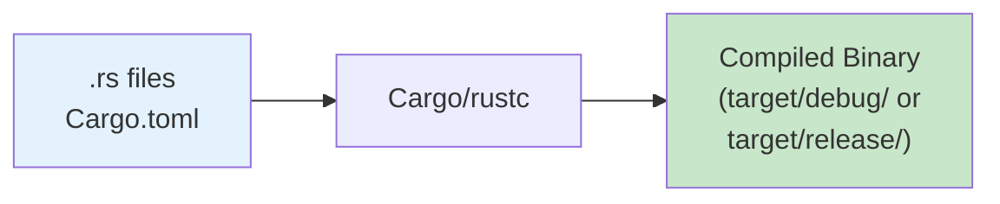
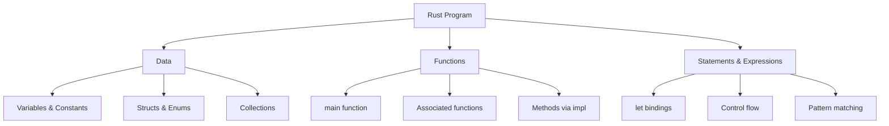
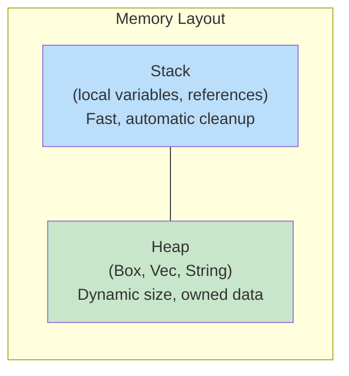
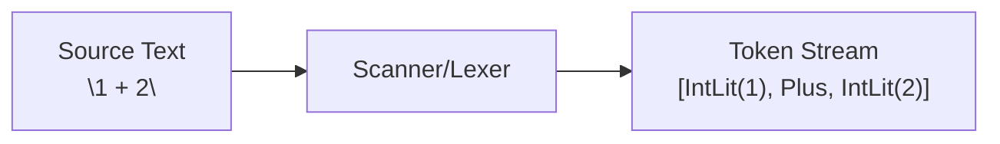

# Rust Programming and Scanning

## Overview

This lecture introduces the fundamentals of Rust programming and continues our exploration of lexical analysis (scanning). We cover the Rust compilation process, ownership and borrowing, pattern matching, and implement a scanner for the NTlang language. Understanding these concepts is essential for implementing the course projects in Rust.

## Learning Objectives

- Understand the Rust compilation pipeline and Cargo build system
- Identify and use Rust's native and composite data types
- Explain ownership, borrowing, and Rust's memory safety guarantees
- Work with enums, pattern matching, and traits
- Implement a basic lexical scanner using Rust idioms

## Prerequisites

- Basic programming experience in any language
- Familiarity with the command line
- Development environment set up (from previous lecture)
- Understanding of C scanning concepts (helpful but not required)

---

## 1. Rust Programming Fundamentals

### The Rust Compilation Pipeline

Rust is a compiled language that emphasizes safety, concurrency, and performance. The `rustc` compiler transforms source code into machine code, but most Rust development uses Cargo, the package manager and build tool.



### Compilation with Cargo

```
# Create a new project
cargo new myproject
cd myproject

# Build the project (debug mode)
cargo build

# Build and run
cargo run

# Build optimized release version
cargo build --release
```

### Project Structure

A typical Rust project has this structure:

```
myproject/
├── Cargo.toml          # Project manifest (dependencies, metadata)
├── src/
│   ├── main.rs         # Main entry point (for binaries)
│   ├── lib.rs          # Library entry point (for libraries)
│   └── bin/            # Additional binaries
│       ├── scan1.rs    # cargo run --bin scan1
│       └── scan2.rs    # cargo run --bin scan2
└── target/             # Build artifacts (generated)
```

### A Complete "Hello World" Example

```
// hello.rs - A complete Rust program demonstrating basic structure

// main - Entry point of every Rust program
//
// Unlike C, Rust's main() takes no arguments by default.
// Command-line args are accessed via std::env::args()
fn main() {
    println!("Hello, World!");
}
```

Compile and run:

```
cargo run
# Or directly with rustc:
rustc hello.rs
./hello
```

---

## 2. Rust Program Structure

### Three Core Components

Every Rust program consists of three fundamental building blocks:



### Example Program Structure

```
// program_structure.rs - Demonstrating Rust program components

// DATA: Constant (evaluated at compile time)
const MAX_VALUE: i32 = 100;

// FUNCTION: Free function
fn add(a: i32, b: i32) -> i32 {
    a + b  // Last expression is the return value
}

// DATA: Struct definition
struct Counter {
    value: i32,
}

// FUNCTION: Methods via impl block
impl Counter {
    fn new() -> Counter {
        Counter { value: 0 }
    }

    fn increment(&mut self) {
        self.value += 1;
    }
}

// FUNCTION: Main entry point
fn main() {
    // DATA: Local variables (immutable by default)
    let x = 5;
    let y = 10;

    // STATEMENT: let binding with expression
    let result = add(x, y);

    // STATEMENT: Macro call (println! is a macro)
    println!("Result: {}", result);

    // DATA: Mutable variable
    let mut counter = Counter::new();
    counter.increment();
    println!("Counter: {}", counter.value);
}
```

---

## 3. Data in Rust

### Memory Model: Stack vs Heap

Rust manages memory automatically without a garbage collector through its ownership system.



**Key differences from C:**
- No manual `malloc`/`free`
- Memory is automatically freed when the owner goes out of scope
- The compiler prevents use-after-free and double-free bugs

### Native Data Types

Rust provides fixed-size primitive types with explicit sizes:

```
// native_types.rs - Rust's primitive data types

fn main() {
    // Signed integers (specified bit width)
    let a: i8 = -128;           // 8-bit signed
    let b: i16 = -32768;        // 16-bit signed
    let c: i32 = -2_147_483_648; // 32-bit signed (default integer)
    let d: i64 = 0;             // 64-bit signed

    // Unsigned integers
    let e: u8 = 255;            // 8-bit unsigned
    let f: u16 = 65535;         // 16-bit unsigned
    let g: u32 = 0xDEAD_BEEF;   // 32-bit unsigned
    let h: u64 = 0x123_456_789; // 64-bit unsigned

    // Platform-dependent sizes
    let i: usize = 0;           // Pointer-sized unsigned (for indexing)
    let j: isize = 0;           // Pointer-sized signed

    // Other primitives
    let k: char = 'A';          // 4 bytes (Unicode scalar value)
    let l: bool = true;         // 1 byte
    let m: f32 = 3.14;          // 32-bit float
    let n: f64 = 3.14159265359; // 64-bit float (default float)

    // Print sizes
    println!("i32:   {} bytes", std::mem::size_of::<i32>());
    println!("u64:   {} bytes", std::mem::size_of::<u64>());
    println!("usize: {} bytes", std::mem::size_of::<usize>());
    println!("char:  {} bytes", std::mem::size_of::<char>());
}
```

### Type Comparison: C vs Rust

| C Type | Rust Type | Size |
| --- | --- | --- |
| `int32_t` | `i32` | 4 bytes |
| `uint32_t` | `u32` | 4 bytes |
| `int64_t` | `i64` | 8 bytes |
| `uint64_t` | `u64` | 8 bytes |
| `size_t` | `usize` | platform-dependent |
| `char` | `u8` or `char` | 1 byte or 4 bytes |
| `float` | `f32` | 4 bytes |
| `double` | `f64` | 8 bytes |

### Composite Data Types

#### Arrays and Vectors

```
// arrays_vectors.rs - Fixed and dynamic collections

fn main() {
    // Arrays: Fixed size, stack-allocated
    // Type is [T; N] where T is element type, N is length
    let arr: [i32; 5] = [1, 2, 3, 4, 5];
    println!("arr[0] = {}", arr[0]);
    println!("Length: {}", arr.len());

    // Initialize all elements to same value
    let zeros: [i32; 10] = [0; 10];

    // Vectors: Dynamic size, heap-allocated
    // Type is Vec<T>
    let mut vec: Vec<i32> = Vec::new();
    vec.push(10);
    vec.push(20);
    vec.push(30);
    println!("vec[1] = {}", vec[1]);
    println!("Length: {}", vec.len());

    // Vector with initial values
    let primes = vec![2, 3, 5, 7, 11, 13];
    println!("Number of primes: {}", primes.len());
}
```

#### Structs

```
// structs.rs - Custom composite types

// Define a struct
struct Person {
    id: u32,
    name: String,
}

fn main() {
    // Create a struct instance
    let person = Person {
        id: 12345,
        name: String::from("Alice"),
    };

    // Access struct fields
    println!("ID: {}", person.id);
    println!("Name: {}", person.name);

    // Struct with shorthand initialization
    let id = 67890;
    let name = String::from("Bob");
    let another = Person { id, name };  // Field names match variable names
    println!("ID: {}, Name: {}", another.id, another.name);
}
```

#### Enums with Associated Data

```
// enums.rs - Enums with data (algebraic data types)

// Rust enums can hold data in each variant
// This is more powerful than C enums (which are just numbers)
#[derive(Debug)]
enum Token {
    IntLit(String),    // Holds a String
    Plus,              // No data
    Minus,             // No data
    Eot,               // No data
}

fn main() {
    let t1 = Token::IntLit(String::from("42"));
    let t2 = Token::Plus;

    // Pattern matching to extract data
    match t1 {
        Token::IntLit(value) => println!("Integer: {}", value),
        Token::Plus => println!("Plus operator"),
        Token::Minus => println!("Minus operator"),
        Token::Eot => println!("End of text"),
    }

    // Debug printing with {:?}
    println!("{:?}", t2);  // Output: Plus
}
```

---

## 4. Ownership and References

### The Three Ownership Rules

1. Each value in Rust has exactly one **owner**
2. When the owner goes out of scope, the value is **dropped** (freed)
3. Ownership can be **moved** to a new owner

```
// ownership.rs - Understanding ownership

fn main() {
    // s1 owns the String
    let s1 = String::from("hello");

    // Ownership moves from s1 to s2
    let s2 = s1;

    // Error! s1 no longer valid after move
    // println!("{}", s1);  // compile error

    // s2 is valid
    println!("{}", s2);
}  // s2 goes out of scope, String is dropped (freed)
```

### References and Borrowing

References allow you to access data without taking ownership:

```
// references.rs - Borrowing with references

fn main() {
    let s = String::from("hello");

    // &s creates an immutable reference (borrow)
    let len = calculate_length(&s);

    // s is still valid because we only borrowed it
    println!("'{}' has length {}", s, len);
}

// &String means "reference to a String" (borrowed, not owned)
fn calculate_length(s: &String) -> usize {
    s.len()
}  // s goes out of scope, but since it doesn't own the String, nothing happens
```

### Mutable References

To modify borrowed data, use mutable references:

```
// mutable_refs.rs - Mutable borrowing

fn main() {
    let mut s = String::from("hello");

    // &mut s creates a mutable reference
    add_world(&mut s);

    println!("{}", s);  // Output: hello, world!
}

fn add_world(s: &mut String) {
    s.push_str(", world!");
}
```

### Borrowing Rules

1. You can have **either** one mutable reference **or** any number of immutable references
2. References must always be valid (no dangling pointers)

```
// borrowing_rules.rs - The borrow checker in action

fn main() {
    let mut s = String::from("hello");

    let r1 = &s;      // OK: first immutable borrow
    let r2 = &s;      // OK: second immutable borrow
    println!("{} and {}", r1, r2);
    // r1 and r2 are no longer used after this point

    let r3 = &mut s;  // OK: mutable borrow (r1, r2 no longer active)
    r3.push_str("!");
    println!("{}", r3);
}
```

### `&self` and `&mut self` in Methods

```
// self_methods.rs - Method receivers

struct Counter {
    value: i32,
}

impl Counter {
    // &self: immutable borrow (can read but not modify)
    fn get(&self) -> i32 {
        self.value
    }

    // &mut self: mutable borrow (can read and modify)
    fn increment(&mut self) {
        self.value += 1;
    }

    // self: takes ownership (consumes the value)
    fn into_value(self) -> i32 {
        self.value
    }
}
```

---

## 5. Strings in Rust

### `String` vs `&str`

Rust has two main string types:

| Type | Ownership | Storage | Use Case |
| --- | --- | --- | --- |
| `String` | Owned | Heap | Mutable, growable strings |
| `&str` | Borrowed | Anywhere | Read-only string slices |

```
// strings.rs - String types in Rust

fn main() {
    // String: owned, heap-allocated, growable
    let mut owned = String::from("hello");
    owned.push_str(", world");
    owned.push('!');
    println!("{}", owned);

    // &str: borrowed slice, often from string literals
    let borrowed: &str = "hello";
    println!("{}", borrowed);

    // Converting between types
    let s: String = borrowed.to_string();  // &str -> String
    let slice: &str = &s;                   // String -> &str (via deref)
}
```

### Building Strings Character by Character

```
// string_building.rs - Constructing strings

fn main() {
    // Start with empty String
    let mut value = String::new();

    // Push individual characters
    value.push('4');
    value.push('2');

    println!("{}", value);  // Output: 42
}
```

### Converting Strings to Characters

```
// string_chars.rs - Working with characters

fn main() {
    let input = "hello";

    // Convert to Vec<char> for indexed access
    let chars: Vec<char> = input.chars().collect();

    println!("First char: {}", chars[0]);
    println!("Length: {}", chars.len());

    // Iterate over characters
    for ch in input.chars() {
        println!("{}", ch);
    }
}
```

---

## 6. Introduction to Scanning (Lexical Analysis)

### What is Scanning?

Scanning (also called lexing or lexical analysis) is the first phase of a compiler or interpreter. It converts a stream of characters into a stream of tokens.



### NTlang Overview

NTlang (Number Tool Language) is a simple expression language we'll implement throughout the course. It supports:
- Integer literals (decimal, hexadecimal, binary)
- Arithmetic operators (+, -, \*, /)
- Bitwise operators (>>, <<, &, |, ^, ~)
- Parentheses for grouping

### Scanning Example

```
Input:  "1 + 2"

Tokens:
  TK_INTLIT  "1"
  TK_PLUS    "+"
  TK_INTLIT  "2"
  TK_EOT     ""
```

```
Input:  "512 + 1024"

Tokens:
  TK_INTLIT  "512"
  TK_PLUS    "+"
  TK_INTLIT  "1024"
  TK_EOT     ""
```

---

## 7. Token Structure (Rust Enums)

### Token Enum with Associated Data

In Rust, enums can hold data, making them perfect for tokens:

```
// token.rs - Token enum definition

// #[derive(Debug, Clone)] tells Rust to automatically generate:
// - Debug: allows printing with {:?} for debugging
// - Clone: allows making copies with .clone()
#[derive(Debug, Clone)]
enum Token {
    IntLit(String),  // Integer literal with its string value
    Plus,            // +
    Minus,           // -
    Mult,            // *
    Div,             // /
    Eot,             // End of text
}
```

**Comparison with C:**

```
// In C, we needed separate storage:
struct scan_token_st {
    enum scan_token_enum id;
    char value[SCAN_TOKEN_LEN];  // separate storage
};
```

In Rust, `IntLit(String)` embeds the value directly in the enum variant.

### Token Methods with `impl`

```
impl Token {
    // Get the token's string value
    fn value(&self) -> &str {
        match self {
            // Pattern matching extracts the inner String
            Token::IntLit(s) => s,
            Token::Plus => "+",
            Token::Minus => "-",
            Token::Mult => "*",
            Token::Div => "/",
            Token::Eot => "",
        }
    }

    fn name(&self) -> &str {
        match self {
            Token::IntLit(_) => "TK_INTLIT",  // _ ignores the value
            Token::Plus => "TK_PLUS",
            Token::Minus => "TK_MINUS",
            Token::Mult => "TK_MULT",
            Token::Div => "TK_DIV",
            Token::Eot => "TK_EOT",
        }
    }
}
```

### Implementing the Display Trait

Traits define shared behavior, like interfaces in other languages:

```
use std::fmt;

// Implement Display trait for nice printing with println!("{}", token)
impl fmt::Display for Token {
    fn fmt(&self, f: &mut fmt::Formatter<'_>) -> fmt::Result {
        write!(f, "{}(\"{}\")", self.name(), self.value())
    }
}
```

Now you can print tokens:

```
let token = Token::IntLit(String::from("42"));
println!("{}", token);  // Output: TK_INTLIT("42")
```

---

## 8. EBNF Grammar

### Extended Backus-Naur Form

EBNF is a notation for describing the syntax of languages. It defines the rules for what sequences of characters form valid tokens.

### EBNF Notation

| Symbol | Meaning |
| --- | --- |
| `::=` | "is defined as" |
| `\|` | "or" (alternative) |
| `()` | Grouping |
| `*` | Zero or more repetitions |
| `+` | One or more repetitions |
| `[]` | Optional (zero or one) |
| `'x'` | Literal character x |

### Scanner EBNF for NTlang

```
tokenlist   ::= (token)*
token       ::= intlit | hexlit | binlit | symbol
symbol      ::= '+' | '-' | '*' | '/' | '>>' | '>-' | '<<'
              | '~' | '&' | '|' | '^' | '(' | ')'
intlit      ::= digit (digit)*
hexlit      ::= '0x' hexdigit (hexdigit)*
binlit      ::= '0b' bindigit (bindigit)*
hexdigit    ::= 'a' | ... | 'f' | 'A' | ... | 'F' | digit
bindigit    ::= '0' | '1'
digit       ::= '0' | ... | '9'

whitespace  ::= (' ' | '\t') (' ' | '\t')*
```

### Reading the Grammar

- `intlit ::= digit (digit)*` means: an integer literal is one digit followed by zero or more digits
- `hexlit ::= '0x' hexdigit (hexdigit)*` means: a hex literal is "0x" followed by one or more hex digits
- `symbol ::= '+' | '-' | ...` means: a symbol is one of the listed characters

---

## 9. Implementing a Scanner

### Scanner Struct

```
// scanner.rs - Scanner structure

struct Scanner {
    chars: Vec<char>,  // Input converted to character array
    pos: usize,        // Current position (like char *p in C)
}

impl Scanner {
    fn new(input: &str) -> Scanner {
        Scanner {
            // Method chaining: chars() creates iterator, collect() gathers into Vec
            chars: input.chars().collect(),
            pos: 0,
        }
    }
}
```

### Helper Methods

```
impl Scanner {
    // Check if at end of input
    fn at_end(&self) -> bool {
        self.pos >= self.chars.len()
    }

    // Get current character (if not at end)
    // Returns Option<char>: Some(ch) or None
    fn current(&self) -> Option<char> {
        if self.at_end() {
            None
        } else {
            Some(self.chars[self.pos])
        }
    }

    // Advance position by one
    fn advance(&mut self) {
        self.pos += 1;
    }

    // Skip whitespace characters
    fn skip_whitespace(&mut self) {
        // while let: loop while pattern matches
        while let Some(ch) = self.current() {
            if ch == ' ' || ch == '\t' {
                self.advance();
            } else {
                break;
            }
        }
    }
}
```

### Scanning Integer Literals

```
impl Scanner {
    // Scan an integer literal: digit (digit)*
    fn scan_intlit(&mut self) -> String {
        let mut value = String::new();

        while let Some(ch) = self.current() {
            // is_ascii_digit() is cleaner than (ch >= '0' && ch <= '9')
            if ch.is_ascii_digit() {
                value.push(ch);
                self.advance();
            } else {
                break;
            }
        }

        value
    }
}
```

### The Main scan\_token Function

```
impl Scanner {
    // Scan a single token
    fn scan_token(&mut self) -> Token {
        // Skip leading whitespace
        self.skip_whitespace();

        // Check for end of input
        match self.current() {
            None => Token::Eot,
            Some(ch) => {
                if ch.is_ascii_digit() {
                    // Integer literal
                    let value = self.scan_intlit();
                    Token::IntLit(value)
                } else {
                    // Operator (or error)
                    self.advance();  // Consume the character
                    match ch {
                        '+' => Token::Plus,
                        '-' => Token::Minus,
                        '*' => Token::Mult,
                        '/' => Token::Div,
                        _ => {
                            eprintln!("scan error: invalid char: {}", ch);
                            std::process::exit(1);
                        }
                    }
                }
            }
        }
    }
}
```

### Scanning All Tokens

```
impl Scanner {
    // Scan all tokens from input
    fn scan_all(&mut self) -> Vec<Token> {
        let mut tokens = Vec::new();

        // loop: infinite loop, break out explicitly
        loop {
            let token = self.scan_token();

            // matches! macro: check if token matches pattern
            let is_eot = matches!(token, Token::Eot);

            tokens.push(token);

            if is_eot {
                break;
            }
        }

        tokens
    }
}
```

---

## 10. Using the Scanner

### Complete Scanner Example

```
// scan2.rs - Complete scanner with command-line interface

use std::env;
use std::fmt;
use std::process;

#[derive(Debug, Clone)]
enum Token {
    IntLit(String),
    Plus,
    Minus,
    Mult,
    Div,
    Eot,
}

impl Token {
    fn value(&self) -> &str {
        match self {
            Token::IntLit(s) => s,
            Token::Plus => "+",
            Token::Minus => "-",
            Token::Mult => "*",
            Token::Div => "/",
            Token::Eot => "",
        }
    }

    fn name(&self) -> &str {
        match self {
            Token::IntLit(_) => "TK_INTLIT",
            Token::Plus => "TK_PLUS",
            Token::Minus => "TK_MINUS",
            Token::Mult => "TK_MULT",
            Token::Div => "TK_DIV",
            Token::Eot => "TK_EOT",
        }
    }
}

impl fmt::Display for Token {
    fn fmt(&self, f: &mut fmt::Formatter<'_>) -> fmt::Result {
        write!(f, "{}(\"{}\")", self.name(), self.value())
    }
}

struct Scanner {
    chars: Vec<char>,
    pos: usize,
}

impl Scanner {
    fn new(input: &str) -> Scanner {
        Scanner {
            chars: input.chars().collect(),
            pos: 0,
        }
    }

    fn at_end(&self) -> bool {
        self.pos >= self.chars.len()
    }

    fn current(&self) -> Option<char> {
        if self.at_end() { None } else { Some(self.chars[self.pos]) }
    }

    fn advance(&mut self) {
        self.pos += 1;
    }

    fn skip_whitespace(&mut self) {
        while let Some(ch) = self.current() {
            if ch == ' ' || ch == '\t' {
                self.advance();
            } else {
                break;
            }
        }
    }

    fn scan_intlit(&mut self) -> String {
        let mut value = String::new();
        while let Some(ch) = self.current() {
            if ch.is_ascii_digit() {
                value.push(ch);
                self.advance();
            } else {
                break;
            }
        }
        value
    }

    fn scan_token(&mut self) -> Token {
        self.skip_whitespace();
        match self.current() {
            None => Token::Eot,
            Some(ch) => {
                if ch.is_ascii_digit() {
                    Token::IntLit(self.scan_intlit())
                } else {
                    self.advance();
                    match ch {
                        '+' => Token::Plus,
                        '-' => Token::Minus,
                        '*' => Token::Mult,
                        '/' => Token::Div,
                        _ => {
                            eprintln!("scan error: invalid char: {}", ch);
                            process::exit(1);
                        }
                    }
                }
            }
        }
    }

    fn scan_all(&mut self) -> Vec<Token> {
        let mut tokens = Vec::new();
        loop {
            let token = self.scan_token();
            let is_eot = matches!(token, Token::Eot);
            tokens.push(token);
            if is_eot { break; }
        }
        tokens
    }
}

fn main() {
    // Get command-line arguments
    let args: Vec<String> = env::args().collect();

    if args.len() != 2 {
        eprintln!("Usage: scan2 <expression>");
        eprintln!("  Example: scan2 \"1 + 2\"");
        process::exit(1);
    }

    // Create scanner and tokenize input
    let mut scanner = Scanner::new(&args[1]);
    let tokens = scanner.scan_all();

    // Print all tokens
    for token in &tokens {
        println!("{}", token);
    }
}
```

### Running the Scanner

```
cargo run --bin scan2 -- "10 + 20 * 3"
```

**Expected Output:**

```
TK_INTLIT("10")
TK_PLUS("+")
TK_INTLIT("20")
TK_MULT("*")
TK_INTLIT("3")
TK_EOT("")
```

---

## Key Concepts

| Concept | Description |
| --- | --- |
| Ownership | Values have a single owner; memory freed when owner goes out of scope |
| Borrowing | References allow temporary access without taking ownership |
| `match` | Exhaustive pattern matching on enums |
| `Option<T>` | Represents optional values (Some/None) |
| Traits | Shared behavior (like interfaces) |
| `Vec<T>` | Growable array type |
| `String` vs `&str` | Owned heap string vs borrowed string slice |
| `impl` | Add methods to structs and enums |

---

## Practice Problems

### Problem 1: Ownership

**Question:** What happens when you compile this code?

```
fn main() {
    let s1 = String::from("hello");
    let s2 = s1;
    println!("{}", s1);
}
```

> **Show Solution**
>
> \*\*Answer:\*\* The code fails to compile with an error like:
> 
> ```
> error[E0382]: borrow of moved value: `s1`
> ```
> 
> \*\*Explanation:\*\*
> 1. `s1` owns the String "hello"
> 2. `let s2 = s1` moves ownership from `s1` to `s2`
> 3. After the move, `s1` is no longer valid
> 4. Attempting to use `s1` in `println!` is an error
> \*\*Fix:\*\* Use `.clone()` to create a copy, or use a reference:
> 
> ```
> let s2 = s1.clone();  // s1 and s2 both valid
> // or
> let s2 = &s1;  // s2 borrows s1
> ```

### Problem 2: Pattern Matching

**Question:** Write a function `token_priority` that takes a `&Token` and returns an `i32` priority (higher = binds tighter). Use these priorities: `*` and `/` = 2, `+` and `-` = 1, others = 0.

```
fn token_priority(token: &Token) -> i32 {
    // Your code here
}
```

> **Show Solution**
>
> ```
> fn token_priority(token: &Token) -> i32 {
>     match token {
>         Token::Mult | Token::Div => 2,
>         Token::Plus | Token::Minus => 1,
>         _ => 0,
>     }
> }
> ```
> 
> \*\*Explanation:\*\*
> - `match` on the reference `&Token`
> - Use `|` to combine patterns for same priority
> - `\_` is the wildcard pattern matching everything else

### Problem 3: Scanner Extension

**Question:** Extend the scanner to support hexadecimal literals (prefix `0x`). The Token enum should have a `HexLit(String)` variant.

> **Show Solution**
>
> Add to the Token enum:
> 
> ```
> #[derive(Debug, Clone)]
> enum Token {
>     IntLit(String),
>     HexLit(String),  // New variant
>     // ... other variants
> }
> ```
> 
> Add helper method to Scanner:
> 
> ```
> impl Scanner {
>     fn scan_hexlit(&mut self) -> String {
>         let mut value = String::new();
>         while let Some(ch) = self.current() {
>             if ch.is_ascii_hexdigit() {
>                 value.push(ch);
>                 self.advance();
>             } else {
>                 break;
>             }
>         }
>         value
>     }
> }
> ```
> 
> Modify `scan\_token`:
> 
> ```
> fn scan_token(&mut self) -> Token {
>     self.skip_whitespace();
>     match self.current() {
>         None => Token::Eot,
>         Some(ch) => {
>             if ch == '0' {
>                 // Check for 0x prefix
>                 self.advance();
>                 if let Some('x') = self.current() {
>                     self.advance();
>                     return Token::HexLit(self.scan_hexlit());
>                 }
>                 // It was just a leading 0, scan as integer
>                 let mut value = String::from("0");
>                 value.push_str(&self.scan_intlit());
>                 return Token::IntLit(value);
>             }
>             if ch.is_ascii_digit() {
>                 Token::IntLit(self.scan_intlit())
>             } else {
>                 // ... rest of operators
>             }
>         }
>     }
> }
> ```

### Problem 4: EBNF

**Question:** Write an EBNF grammar rule for a C-style identifier: starts with a letter or underscore, followed by zero or more letters, digits, or underscores.

> **Show Solution**
>
> ```
> identifier  ::= (letter | '_') (letter | digit | '_')*
> letter      ::= 'a' | ... | 'z' | 'A' | ... | 'Z'
> digit       ::= '0' | ... | '9'
> ```
> 
> \*\*Explanation:\*\*
> - `(letter | '\_')` - must start with a letter or underscore
> - `(letter | digit | '\_')\*` - followed by zero or more of: letters, digits, or underscores
> \*\*Examples of valid identifiers:\*\*
> - `x`
> - `\_count`
> - `myVariable123`
> - `\_\_internal\_\_`
> \*\*Examples of invalid identifiers:\*\*
> - `123abc` (starts with digit)
> - `my-var` (contains hyphen)

---

## Further Reading

- **The Rust Programming Language** ("The Book") - [doc.rust-lang.org/book](https://doc.rust-lang.org/book/)
- **Rust by Example** - [doc.rust-lang.org/rust-by-example](https://doc.rust-lang.org/rust-by-example/)
- **Crafting Interpreters** by Robert Nystrom - Excellent resource on scanners and parsers
- [Cargo Book](https://doc.rust-lang.org/cargo/) - Official Cargo documentation

---

## Summary

1. **Rust Compilation**: Rust code is compiled with `rustc` or Cargo. Cargo manages projects, dependencies, and builds.
2. **Ownership and Borrowing**: Rust ensures memory safety through ownership rules. Each value has one owner, and references allow borrowing without transferring ownership.
3. **Enums and Pattern Matching**: Rust enums can hold data, and `match` expressions provide exhaustive pattern matching. This is ideal for token representation.
4. **Traits**: Traits define shared behavior. Implementing `Display` allows custom printing with `println!("{}", value)`.
5. **Lexical Analysis**: Scanning converts characters into tokens. Each token has a type (enum variant) and optionally associated data.
6. **EBNF Grammars**: Extended Backus-Naur Form provides a formal way to specify the syntax of tokens and language constructs, guiding scanner and parser implementation.