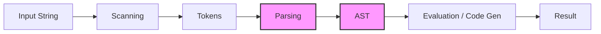
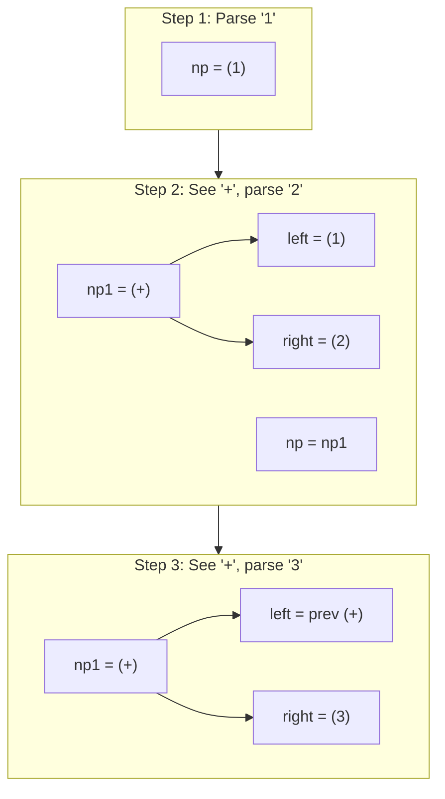

# Parsing and Abstract Syntax Trees

## Overview

This lecture covers the second phase of language processing: parsing. After the scanner produces a stream of tokens, the parser analyzes the token sequence according to a grammar and constructs an Abstract Syntax Tree (AST). The AST represents the hierarchical structure of the program and serves as the foundation for interpretation or code generation.

## Learning Objectives

- Understand the role of parsing in language processing
- Learn different parser types (LL, LR, GLR, PEG) and their trade-offs
- Recognize and eliminate left recursion in grammars
- Read and apply EBNF grammar rules for parsing
- Implement a recursive descent parser that constructs an AST
- Understand the structure and purpose of Abstract Syntax Trees

## Prerequisites

- Understanding of scanning and token streams (Lecture 3)
- Basic understanding of formal grammars and EBNF notation
- Familiarity with tree data structures
- C or Rust programming experience

---

## 1. Language Processing Pipeline

Recall the language processing pipeline from scanning:



**Today's focus**: The **parsing** phase that converts tokens into an AST.

The scanner converts input like `"1 + 2 + 3"` into tokens:

```
TK_INTLIT("1") | TK_PLUS("+") | TK_INTLIT("2") | TK_PLUS("+") | TK_INTLIT("3") | TK_EOT
```

The parser takes these tokens and builds a tree that captures the expression's structure.

---

## 2. From Tokens to Trees - Why Structure Matters

### Why Not Just Use a Flat Token List?

Consider the expression `1 + 2 * 3`. Without structure, we might evaluate left-to-right getting `9`, but mathematically the answer should be `7` (multiply first).

Trees capture structure explicitly:

**Left-to-right evaluation (no precedence):**

```
      *
     / \
    +   3
   / \
  1   2
Result: (1 + 2) * 3 = 9
```

**Mathematical precedence:**

```
      +
     / \
    1   *
       / \
      2   3
Result: 1 + (2 * 3) = 7
```

In NTLang, we use a simpler approach: all operators have the **same precedence** and associate **left-to-right**. Parentheses control grouping explicitly.

### NTLang Evaluation Rules

| Expression | Interpretation | Result |
| --- | --- | --- |
| `1 + 2 * 3` | `(1 + 2) * 3` | 9 |
| `1 + (2 * 3)` | `1 + (2 * 3)` | 7 |
| `1 + 2 + 3` | `(1 + 2) + 3` | 6 |

---

## 3. Parser Types Overview

Parsers transform a sequence of tokens into a structured representation (typically an AST). Different parsing strategies offer various trade-offs:

| Parser Type | Description | Strengths | Limitations |
| --- | --- | --- | --- |
| **LL** | Top-down, left-to-right, leftmost derivation | Simple to implement by hand | Cannot handle left recursion |
| **LR** | Bottom-up, left-to-right, rightmost derivation | Fast, handles more grammars | Complex to implement manually |
| **GLR** | Generalized LR | Handles ambiguous grammars | More complex, slower |
| **PEG** | Parsing Expression Grammar | Deterministic, handles left recursion | Different semantics than CFGs |

For NTLang, we use an **LL parser** because:
- Simple to implement by hand using recursive descent
- Each grammar rule becomes a function
- Easy to understand and debug

### LL(k) Notation

The notation **LL(k)** indicates how many tokens of lookahead are needed:

- **LL(1)**: One token lookahead (most common)
- **LL(2)**: Two tokens lookahead
- **LL(k)**: k tokens lookahead

Our NTLang parser is **LL(1)** - we only need to look at the current token to decide what to do.

---

## 4. EBNF Grammar for NTLang Parsing

The parser follows this grammar:

```
program    ::= expression EOT

expression ::= operand (operator operand)*

operand    ::= intlit
             | hexlit
             | binlit
             | '-' operand
             | '~' operand
             | '(' expression ')'

operator   ::= '+' | '-' | '*' | '/' | '>>' | '<<' | '&' | '|' | '^' | '>-'
```

### Understanding the Grammar

- **program**: A complete NTLang program is an expression followed by end-of-text
- **expression**: An operand optionally followed by any number of (operator, operand) pairs
- **operand**: Can be a literal, a unary operation, or a parenthesized expression

The key insight is that `(operator operand)*` means "zero or more" pairs of operator and operand.

### Grammar to Code Mapping

| Grammar Element | Code Construct |
| --- | --- |
| Rule name | Function name |
| `::=` | Function body |
| `A B` (sequence) | Call A then B |
| `A \| B` (alternative) | if/else or match |
| `(A)*` (repetition) | while loop |
| `[A]` (optional) | if statement |
| Terminal (token) | `accept(TOKEN)` |

---

## 5. Recursive Descent Parsing

Recursive descent is a top-down parsing technique where:

1. **One function per grammar rule** - Each non-terminal in the grammar becomes a function
2. **Functions call each other** - Following the grammar structure
3. **Recursion handles nesting** - Parenthesized expressions call back to `parse_expression`

### The Accept/Get Pattern

Two key operations for consuming tokens:

| Operation | Purpose | Returns |
| --- | --- | --- |
| `accept(TOKEN)` | Check if current token matches; if so, consume it | `true`/`false` |
| `get(i)` | Look at token at position `cur + i` without consuming | Token reference |

Common pattern:

```
if (accept(TK_PLUS)) {
    // Token was TK_PLUS and has been consumed
    tp = get(-1);  // Get the token we just consumed
}
```

### Parsing Function Structure

Each parsing function follows this pattern:

```
parse_X:
    1. Check what token we're looking at
    2. Based on the token, decide which alternative to take
    3. Consume expected tokens
    4. Recursively parse sub-expressions
    5. Build and return AST node
```

---

## 6. The Left Recursion Problem

### What is Left Recursion?

Left recursion occurs when a grammar rule references itself as its leftmost symbol:

```
expression ::= expression '+' operand
             | operand
```

This grammar correctly describes expressions like `1 + 2 + 3`, but causes **infinite recursion** in a top-down parser:

```
void parse_expression() {
    parse_expression();  // Infinite recursion!
    accept(TK_PLUS);
    parse_operand();
}
```

The parser calls itself immediately without consuming any input, causing a stack overflow.

### Eliminating Left Recursion

We rewrite left-recursive grammars using iteration (the Kleene star `*`):

**Original (left-recursive):**

```
expression ::= expression operator operand
             | operand
```

**Transformed (iteration):**

```
expression ::= operand (operator operand)*
```

Both grammars accept the same language, but the second can be parsed top-down:

```
parse_node_st *parse_expression(...) {
    np = parse_operand(...);        // Parse first operand

    while (is_operator(current_token)) {
        accept(operator);
        right = parse_operand(...);
        np = create_oper2_node(op, np, right);
    }

    return np;
}
```

---

## 7. Abstract Syntax Trees

### What is an AST?

An Abstract Syntax Tree (AST) is a tree representation of the syntactic structure of source code. Unlike a parse tree, it:

- **Abstracts away** syntactic details (parentheses, keywords)
- **Preserves** essential structure (operations, operands)
- **Enables** interpretation or code generation

### AST Node Types in NTLang

| Node Type | Description | Children |
| --- | --- | --- |
| `INTVAL` | Integer literal (leaf node) | None |
| `OPER1` | Unary operator | 1 child (operand) |
| `OPER2` | Binary operator | 2 children (left, right) |

### AST Examples

**Expression: `1 + 2`**

```
         (+)          <- OPER2, oper=PLUS
        /   \
      (1)   (2)       <- INTVAL nodes
```

**Expression: `1 + 2 + 3` (left-associative)**

```
            (+)           <- OPER2
           /   \
         (+)   (3)        <- OPER2, INTVAL
        /   \
      (1)   (2)           <- INTVAL nodes

Evaluates as: (1 + 2) + 3 = 6
```

**Expression: `(1 + 2) * 3`**

```
            (*)
           /   \
         (+)   (3)
        /   \
      (1)   (2)

Evaluates as: (1 + 2) * 3 = 9
```

**Expression: `-5` (unary minus)**

```
         (-)          <- OPER1, oper=MINUS
          |
         (5)          <- INTVAL
```

### Building Left-Associative Trees

The key to left-associativity is making the **previous result** the **left child** of each new operator:



---

## Key Concepts

| Concept | Definition | Example |
| --- | --- | --- |
| **Parsing** | Converting tokens to structured representation | Tokens → AST |
| **AST** | Abstract Syntax Tree - hierarchical program representation | Tree with operator nodes |
| **Recursive Descent** | Parsing technique with one function per grammar rule | `parse_expression()`, `parse_operand()` |
| **Left Associativity** | Operators group from left to right | `1+2+3` = `(1+2)+3` |
| **Left Recursion** | Grammar rule that calls itself first | `E ::= E '+' T` |
| **Unary Operator** | Operator with one operand | `-x`, `~x` |
| **Binary Operator** | Operator with two operands | `x + y` |
| **Lookahead** | Examining tokens without consuming them | `get(0)` |
| **Accept** | Consuming a token if it matches | `accept(TK_PLUS)` |

---

## Practice Problems

### Problem 1: Draw the AST

Draw the AST for the expression `"(1 + 2) * 3"`.

> **Click to reveal solution**
>
> ```
>         (*)
>        /   \
>      (+)   (3)
>     /   \
>   (1)   (2)
> 
> Node types:
> - Root: OPER2, oper=MULT
>   - Left child: OPER2, oper=PLUS
>     - Left: INTVAL, value=1
>     - Right: INTVAL, value=2
>   - Right child: INTVAL, value=3
> ```

### Problem 2: Left-Associative Tree

Draw the AST for `"1 - 2 - 3"` and explain why it evaluates to `-4`, not `2`.

> **Click to reveal solution**
>
> ```
>             (-)
>            /   \
>          (-)   (3)
>         /   \
>       (1)   (2)
> 
> Evaluation (left-associative):
> - Inner subtraction: 1 - 2 = -1
> - Outer subtraction: -1 - 3 = -4
> 
> If it were right-associative (1 - (2 - 3)):
> - Inner: 2 - 3 = -1
> - Outer: 1 - (-1) = 2
> 
> The tree structure determines the evaluation order!
> ```

### Problem 3: Trace the Parser

For input `"-5"`, trace through the parsing functions called.

> **Click to reveal solution**
>
> ```
> 1. parse_program() called
> 2.   parse_expression() called
> 3.     parse_operand() called
> 4.       accept(TK_INTLIT) -> false
> 5.       accept(TK_MINUS) -> true (consumes -)
> 6.       Create np1: OPER1, oper=MINUS
> 7.       parse_operand() called recursively
> 8.         accept(TK_INTLIT) -> true (consumes 5)
> 9.         Create np: INTVAL, value=5
> 10.        Return np
> 11.      np1.operand = np
> 12.      Return np1
> 13.   No operator found, return np (the MINUS node)
> 14. accept(TK_EOT) -> true
> 15. Return tree
> 
> Final tree:
>     (-)         <- OPER1
>      |
>     (5)         <- INTVAL
> ```

### Problem 4: Node Count

For expression `"1 + 2 + 3 + 4"`, how many nodes are in the AST?

> **Click to reveal solution**
>
> \*\*7 nodes total:\*\*
> - 4 INTVAL nodes (1, 2, 3, 4)
> - 3 OPER2 nodes (three + operators)
> \*\*Tree structure:\*\*
> 
> ```
>                 (+)         <- node 7, root
>                /   \
>              (+)   (4)      <- nodes 6, 4
>             /   \
>           (+)   (3)         <- nodes 5, 3
>          /   \
>        (1)   (2)            <- nodes 1, 2
> ```
> 
> This represents `((1 + 2) + 3) + 4`.

### Problem 5: Grammar Transformation

Transform this left-recursive grammar into one suitable for recursive descent:

```
term ::= term '*' factor
       | factor
```

> **Click to reveal solution**
>
> \*\*Transformed grammar:\*\*
> 
> ```
> term ::= factor ('*' factor)*
> ```
> 
> \*\*Implementation pattern:\*\*
> 
> ```
> parse_node_st *parse_term(...) {
>     np = parse_factor(...);
> 
>     while (accept(TK_MULT)) {
>         right = parse_factor(...);
>         np = create_oper2(MULT, np, right);
>     }
> 
>     return np;
> }
> ```

---

## Further Reading

- [Crafting Interpreters - Parsing Expressions](https://craftinginterpreters.com/parsing-expressions.html)
- [Recursive Descent Parsing (Wikipedia)](https://en.wikipedia.org/wiki/Recursive_descent_parser)
- [Abstract Syntax Trees (Wikipedia)](https://en.wikipedia.org/wiki/Abstract_syntax_tree)
- Dragon Book Chapter 4: Syntax Analysis

---

## Summary

1. **The parser converts tokens into an AST** that represents the hierarchical structure of the program.
2. **LL parsers** are simple to implement by hand but cannot handle left-recursive grammars directly.
3. **Recursive descent parsing** uses one function per grammar rule, with functions calling each other recursively to build the tree.
4. **Left recursion is eliminated** by transforming the grammar to use iteration (`*` instead of recursion).
5. **The AST has three node types**: `INTVAL` for values, `OPER1` for unary operators, and `OPER2` for binary operators.
6. **Left-associative tree construction** means `1 + 2 + 3` becomes `(1 + 2) + 3`, built by always making the previous result the left child.
7. **Parentheses create subtrees** by recursively calling `parse_expression()`, ensuring proper grouping regardless of the surrounding context.