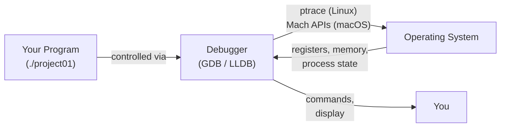

# Debugging C and Rust with GDB and LLDB

## Overview

Debugging is one of the most valuable skills in systems programming. While `printf` and `eprintln!` can help locate issues in simple programs, a full debugger — GDB on Linux, LLDB on macOS — gives you the power to pause a running program at any point, inspect memory, examine the call stack, and step through code one line at a time. In this lecture we use **project01-starter** (the ntlang arithmetic parser/evaluator) as a concrete debugging target, working with both the C and Rust implementations.

## Learning Objectives

- Understand what a debugger is and how it controls a running process
- Launch GDB on Linux and LLDB on macOS with a target program
- Set breakpoints by function name and source location
- Step through code with `next` (step over) and `step` (step into)
- Inspect variables, struct fields, and pointer-chained data with `print`
- Read the call stack with `backtrace` and navigate frames
- Use `rust-gdb` and `rust-lldb` to debug Rust programs with pretty-printed types
- Identify and observe a real buffer overflow in project01's C scanner

## Prerequisites

- Completed project01-starter (or reviewed the source in `c/` and `rust/`)
- Basic C and Rust familiarity
- Access to a terminal on Linux (for GDB) or macOS (for LLDB)

---

## 1. What is a Debugger?

A debugger is a program that controls the execution of another program — the **target** — allowing you to pause, inspect, and modify it at any point during execution.



### What a Debugger Can Do

| Capability | Description |
| --- | --- |
| Breakpoints | Pause execution when a specific function or source line is reached |
| Stepping | Execute one line at a time: `next` (step over), `step` (step into) |
| Inspection | Read any variable, struct field, or memory address |
| Backtrace | Show the full chain of function calls leading to the current point |
| Watchpoints | Pause automatically whenever a variable's value changes |
| Frame navigation | Inspect local variables in any frame on the call stack |

### Debugger vs. Printf

| `printf` / `eprintln!` | Debugger |
| --- | --- |
| Requires recompile for each new print | No recompile — fully interactive |
| Output is fixed at compile time | Inspect any variable on the fly |
| Hard to follow complex struct chains | Full pointer traversal |
| No call-stack visibility | Complete backtrace |
| Quick sanity checks | Systematic investigation |

Use `printf`/`eprintln!` for quick sanity checks. Use a debugger when you need to understand *why* something is wrong — especially with complex data structures like the parse tree in project01.

---

## 2. The GDB and LLDB Ecosystem

### GDB — GNU Debugger (Linux)

GDB is the standard debugger on Linux systems. It supports C, C++, Rust, and many other languages. Install with your package manager:

```
sudo apt install gdb        # Debian / Ubuntu
sudo dnf install gdb        # Fedora / RHEL
```

### LLDB — LLVM Debugger (macOS)

LLDB ships with the Xcode command-line tools on macOS. It is the default debugger for C/C++ and Rust on Apple platforms:

```
xcode-select --install      # installs LLDB on macOS
```

### rust-gdb and rust-lldb

Raw GDB and LLDB display internal Rust data structures (e.g., `Vec<T>`, `String`, `Option<T>`, `Result<T,E>`, enums) in their low-level memory form, which is difficult to read. The `rust-gdb` and `rust-lldb` wrappers load **Rust pretty-printers** that display these types in human-readable form.

| Tool | Platform | Use for |
| --- | --- | --- |
| `gdb` | Linux | C programs |
| `lldb` | macOS | C programs |
| `rust-gdb` | Linux | Rust programs |
| `rust-lldb` | macOS | Rust programs |

`rust-gdb` and `rust-lldb` are installed with the Rust toolchain (`rustup`). They are drop-in replacements for `gdb`/`lldb` with Rust-specific extensions loaded automatically.

### Compiling with Debug Information

Debuggers need symbol information embedded in the binary to map machine instructions back to source lines, variable names, and types.

**C** — pass `-g` to GCC. The project01 `c/Makefile` already includes this flag:

```
cd ~/project01-starter/c && make    # produces ./project01 with debug symbols
```

**Rust** — `cargo build` without `--release` always produces a debug build with full symbol information:

```
cd ~/project01-starter/rust && cargo build   # produces ./target/debug/project01
```

Never debug a release build

`-O2`/`-O3` (C) or `--release` (Rust) optimizations inline functions, eliminate variables, and reorder code. Stepping through an optimized binary is nearly impossible and the variable values shown by the debugger may be wrong.

---

## 3. Essential Commands Reference

### GDB vs. LLDB Side-by-Side

| Action | GDB | LLDB | Short |
| --- | --- | --- | --- |
| Start with arguments | `run "1 + 2"` | `run "1 + 2"` | `r` |
| Break at function | `break main` | `breakpoint set --name main` | `b main` |
| Break at file:line | `break scan.c:50` | `breakpoint set -f scan.c -l 50` | `b scan.c:50` |
| Continue execution | `continue` | `continue` | `c` |
| Step over (next line) | `next` | `next` | `n` |
| Step into (enter call) | `step` | `step` | `s` |
| Print expression | `print expr` | `print expr` | `p expr` |
| Print local variables | `info locals` | `frame variable` | — |
| Show call stack | `backtrace` | `thread backtrace` | `bt` |
| Select stack frame | `frame N` | `frame select N` | `f N` |
| List source code | `list` | `list` | `l` |
| Examine memory | `x/4xw addr` | `memory read -s4 -fx -c4 addr` | — |
| Set watchpoint | `watch var` | `watchpoint set variable var` | — |
| Run until return | `finish` | `finish` | — |
| Quit | `quit` | `quit` | `q` |

### Short Aliases

Both GDB and LLDB accept single-letter shortcuts for the most common commands (`r`, `b`, `c`, `n`, `s`, `p`, `bt`, `l`, `q`). In GDB, pressing **Enter** repeats the last command — very useful when single-stepping through a loop.

---

## 4. Debugging C Code with GDB (Linux)

### Build

```
cd ~/project01-starter/c && make
```

### Launch

```
gdb ./project01
```

This loads the binary into GDB but does not start it. Set breakpoints first, then call `run`.

### Session A: Basic Walkthrough — Scanning

This session traces the input `"1 + 2"` through the scanner and inspects the resulting token table.

```
$ gdb ./project01
GNU gdb (Ubuntu 12.1-...) ...
(gdb) break main
Breakpoint 1 at 0x11a0: file project01.c, line 6.
(gdb) run "1 + 2"
Starting program: ./project01 "1 + 2"

Breakpoint 1, main (argc=2, argv=0x7fffffffe5c8) at project01.c:6
6           struct config_st config;
(gdb) list
1       /* project01.c - initial parsing implementation */
3       #include "ntlang.h"
5       int main(int argc, char **argv) {
6           struct config_st config;
7           struct scan_table_st scan_table;
8           struct parse_table_st parse_table;
9           struct parse_node_st *parse_tree;
10          uint32_t value;
(gdb) break scan_table_scan
Breakpoint 2 at 0x1370: file scan.c, line 110.
(gdb) continue
Continuing.

Breakpoint 2, scan_table_scan (st=0x7fffffffd830, input=0x7fffffffe878 "1 + 2")
    at scan.c:110
110     struct scan_token_st *tp;
(gdb) print *st
$1 = {table = {...}, len = 0, cur = 0}
(gdb) print st->len
$2 = 0
(gdb) finish
Run till exit from #0  scan_table_scan (st=0x7fffffffd830, input=...)
    at scan.c:110
main (argc=2, argv=...) at project01.c:22
22          scan_table_print(&scan_table);
(gdb) print scan_table.len
$3 = 4
(gdb) print scan_table.table[0]
$4 = {id = TK_INTLIT, value = "1", '\000' <repeats 30 times>}
(gdb) print scan_table.table[1]
$5 = {id = TK_PLUS, value = "+", '\000' <repeats 30 times>}
(gdb) print scan_table.table[2]
$6 = {id = TK_INTLIT, value = "2", '\000' <repeats 30 times>}
(gdb) print scan_table.table[3]
$7 = {id = TK_EOT, value = "", '\000' <repeats 31 times>}
```

After scanning `"1 + 2"`, `scan_table.len` is 4: two integer literals, a plus sign, and the end-of-text marker. The `finish` command runs `scan_table_scan` to completion and returns to the caller, where we can inspect `scan_table` directly.

### Session B: Inspecting the Parse Tree

After parsing, inspect the abstract syntax tree node for `1 + 2`.

```
(gdb) break parse_program
Breakpoint 3 at 0x1580: file parse.c, line 38.
(gdb) continue
Continuing.
TK_INTLIT("1")
TK_PLUS("+")
TK_INTLIT("2")
TK_EOT("")

Breakpoint 3, parse_program (pt=0x7fffffffac30, st=0x7fffffffd830)
    at parse.c:38
38          np1 = parse_expression(pt, st);
(gdb) finish
Run till exit from #0  parse_program (pt=..., st=...) at parse.c:38
main (argc=2, argv=...) at project01.c:27
27          parse_tree_print(parse_tree);
(gdb) print parse_tree->type
$8 = EX_OPER2
(gdb) print parse_tree->oper2.oper
$9 = OP_PLUS
(gdb) print parse_tree->oper2.left->type
$10 = EX_INTVAL
(gdb) print parse_tree->oper2.left->intval.value
$11 = 1
(gdb) print parse_tree->oper2.right->intval.value
$12 = 2
```

GDB follows pointers automatically. The expression `parse_tree->oper2.left->intval.value` traverses two levels of pointer indirection to reach the integer value stored in the left operand node. GDB also displays enum values by name (`EX_OPER2`, `OP_PLUS`) rather than as raw integers.

### Session C: Catching the Buffer Overflow in scan\_intlit

The `scan_intlit` function in `scan.c` contains a buffer overflow. The token value buffer is declared as `char value[SCAN_TOKEN_LEN]` where `SCAN_TOKEN_LEN = 32`, giving valid indices `0` through `31`. But `scan_intlit` never checks whether `i` has exceeded this bound:

```
char * scan_intlit(char *p, char *end, struct scan_token_st *tp) {
    int i = 0;
    while (scan_is_digit(*p) && (p < end)) {
        tp->value[i] = *p;   /* NO bounds check on i! */
        p += 1;
        i += 1;
    }
    tp->value[i] = '\0';     /* also overflows when i == 32 */
    tp->id = TK_INTLIT;
    return p;
}
```

With 33 or more digit characters, writes to `tp->value[32]` and beyond corrupt adjacent memory. Let's observe this with a debugger:

```
$ gdb ./project01
(gdb) break scan_intlit
Breakpoint 1 at 0x1280: file scan.c, line 51.
(gdb) run "123456789012345678901234567890123"
Starting program: ./project01 "123456789012345678901234567890123"

Breakpoint 1, scan_intlit (p=0x7fffffffe87a "123456789012345678901234567890123",
    end=0x7fffffffe89b "", tp=0x7fffffffdba0) at scan.c:51
51          int i = 0;
(gdb) info locals
i = 0
p = 0x7fffffffe87a "12345678901234567890123456789012 ..."
end = 0x7fffffffe89b ""
tp = 0x7fffffffdba0
(gdb) break scan.c:53 if i == 31
Breakpoint 2 at 0x12a4: scan.c:53. (1 condition)
(gdb) continue
Continuing.

Breakpoint 2, scan_intlit (...) at scan.c:53
53              tp->value[i] = *p;
(gdb) print i
$1 = 31
(gdb) print *p
$2 = 50 '2'
(gdb) next
(gdb) print i
$3 = 31
(gdb) next
(gdb) print i
$4 = 32
(gdb) print tp->value[31]
$5 = 50 '2'
(gdb) print &tp->value[32]
$6 = (char *) 0x7fffffffdbc0 "\000\000\000\000"
```

At `i = 32`, the next iteration of the loop writes `tp->value[32]` — one byte past the end of the 32-byte buffer. The bytes written beyond index 31 overwrite adjacent memory in the `scan_table_st.table` array, potentially corrupting the next token's `id` field or causing a crash far from the original overflow site.

Examine memory around the buffer boundary:

```
(gdb) x/8xb tp->value + 28
0x7fffffffdbc0: 0x39  0x30  0x31  0x00  0x00  0x00  0x00  0x00
```

After adding the bounds check `i < SCAN_TOKEN_LEN - 1` to the `while` condition, this overflow is prevented.

---

## 5. Debugging C Code with LLDB (macOS)

### Launch

```
lldb -- ./project01 "1 + 2"
```

The `--` separates LLDB's own options from the arguments passed to the target program.

### Session A: Basic Walkthrough

```
(lldb) breakpoint set --name main
Breakpoint 1: where = project01`main + 22 at project01.c:6
(lldb) run
Process 12345 launched: './project01'
Process 12345 stopped
* thread #1, stop reason = breakpoint 1.1
    frame #0: project01`main(argc=2, argv=...) at project01.c:6
   6        struct config_st config;

(lldb) breakpoint set --name scan_table_scan
Breakpoint 2: where = project01`scan_table_scan + 0 at scan.c:110
(lldb) continue
Process 12345 resuming
Process 12345 stopped
* thread #1, stop reason = breakpoint 2.1
    frame #0: project01`scan_table_scan(st=..., input="1 + 2") at scan.c:110
  110     struct scan_token_st *tp;

(lldb) frame variable
(struct scan_table_st *) st = 0x00007ffeefbff6b0
(char *) input = 0x00007ffeefbff8c8 "1 + 2"

(lldb) p st->len
(int) $0 = 0
(lldb) finish
(lldb) p scan_table.len
(int) $1 = 4
(lldb) p scan_table.table[0]
(scan_token_st) $2 = {id = TK_INTLIT, value = "1"}
(lldb) p scan_table.table[1]
(scan_token_st) $3 = {id = TK_PLUS, value = "+"}
```

The key difference from GDB: use `frame variable` instead of `info locals` to list all local variables and parameters in the current frame.

### Session B: Backtrace and Frame Navigation

Set a breakpoint deep inside the scanner and examine the full call stack:

```
(lldb) breakpoint set --name scan_intlit
(lldb) run "5 - 3"
Process stopped at scan_intlit

(lldb) thread backtrace
* thread #1, queue = 'com.apple.main-thread', stop reason = breakpoint 3.1
  * frame #0: project01`scan_intlit(p=..., end=..., tp=...) at scan.c:51
    frame #1: project01`scan_token(p=..., end=..., tp=...) at scan.c:79
    frame #2: project01`scan_table_scan(st=..., input=...) at scan.c:125
    frame #3: project01`main(argc=2, argv=...) at project01.c:21
    frame #4: libdyld.dylib`start + 1

(lldb) frame select 3
frame #3: project01`main(...) at project01.c:21
   21          scan_table_scan(&scan_table, config.input);

(lldb) frame variable
(struct config_st) config = {input = "5 - 3"}
(struct scan_table_st) scan_table = {table = {...}, len = 0, cur = 0}

(lldb) frame select 0
(lldb) frame variable
(char *) p = "5 - 3"
(char *) end = ""
(struct scan_token_st *) tp = 0x...
```

`frame select N` lets you "walk up" the call stack and inspect variables in any calling function — without the program actually returning from those functions. This is invaluable for understanding the context in which a bug occurs.

### GDB ↔ LLDB Quick Reference

| Task | GDB | LLDB |
| --- | --- | --- |
| Break at function | `break scan_intlit` | `b scan_intlit` |
| Break at line | `break scan.c:50` | `b scan.c:50` |
| Show locals | `info locals` | `frame variable` |
| Show call stack | `backtrace` | `thread backtrace` |
| Select frame | `frame 2` | `frame select 2` |
| Print struct | `print *st` | `p *st` |
| Examine memory | `x/4xb addr` | `memory read -s1 -fx -c4 addr` |
| Watchpoint | `watch i` | `watchpoint set variable i` |

---

## 6. Debugging Rust Code with rust-gdb (Linux)

### Build

```
cd ~/project01-starter/rust && cargo build
# Binary: ./target/debug/project01
```

### Launch

```
rust-gdb ./target/debug/project01
```

### What rust-gdb Adds

Without Rust pretty-printers, `Vec<Token>` looks like raw memory in GDB:

```
$1 = alloc::vec::Vec<scan::Token> {
  buf: alloc::raw_vec::RawVec<scan::Token, alloc::alloc::Global> {
    inner: alloc::raw_vec::RawVecInner<...> {
      ptr: core::ptr::unique::Unique<scan::Token> {...},
      cap: alloc::raw_vec::Cap (4),
      alloc: alloc::alloc::Global
    }
  },
  len: 4
}
```

With `rust-gdb` pretty-printers, the same value is displayed as:

```
$1 = Vec(size=4) = {
  scan::Token::IntLit("1"),
  scan::Token::Plus,
  scan::Token::IntLit("2"),
  scan::Token::Eot
}
```

The pretty-printers also decode Rust **enum variants** by name (e.g., `ParseNode::Oper2`), print `String` as a human-readable string, and display `Option<T>` and `Result<T,E>` with their variant names.

### Session A: Break at main, Inspect ScanTable

```
(gdb) break project01::main
Breakpoint 1 at 0x8e20: file src/main.rs, line 13.
(gdb) run "1 + 2"
Starting program: ./target/debug/project01 "1 + 2"
[Thread debugging using libthread_db enabled]

Breakpoint 1, project01::main () at src/main.rs:13
13          let args: Vec<String> = env::args().collect();

(gdb) break project01::scan::ScanTable::scan
Breakpoint 2 at 0x...: file src/scan.rs, line 186.
(gdb) continue
Continuing.

Breakpoint 2, project01::scan::ScanTable::scan (self=..., input=...) at src/scan.rs:186
(gdb) finish
Run till exit from scan()
project01::main () at src/main.rs:26
26          scan_table.print();
(gdb) print scan_table
$1 = scan::ScanTable {
  tokens: Vec(size=4) = {
    scan::Token::IntLit("1"),
    scan::Token::Plus,
    scan::Token::IntLit("2"),
    scan::Token::Eot
  },
  cur: 0
}
```

### Session B: Inspecting a Rust Enum — ParseNode

```
(gdb) break project01::parse::parse_program
Breakpoint 3 at 0x...: file src/parse.rs, line 108.
(gdb) continue
Continuing.
TK_INTLIT("1")
TK_PLUS("+")
TK_INTLIT("2")
TK_EOT("")

Breakpoint 3, project01::parse::parse_program (scan_table=...) at src/parse.rs:108
(gdb) finish
(gdb) print parse_tree
$2 = parse::ParseNode::Oper2 {
  oper: parse::Operator::Plus,
  left: parse::ParseNode::IntVal {
    value: 1
  },
  right: parse::ParseNode::IntVal {
    value: 2
  }
}
```

Rust enums are tagged unions. Without pretty-printers, you would need to manually read the discriminant value and interpret the correct union branch. The `rust-gdb` pretty-printers handle this automatically, displaying both the variant name and all named fields.

### Rust-Specific Considerations

- **Ownership does not affect the debugger**: the debugger operates at the machine level, below Rust's ownership and borrow checking. You can print any value in scope.
- **No GC pauses**: Rust has no garbage collector, so execution is deterministic and debugger breakpoints work predictably.
- **Panic backtraces**: set `RUST_BACKTRACE=1` before running to get an automatic stack trace when the program panics, without needing to launch a debugger.

---

## 7. Debugging Rust Code with rust-lldb (macOS)

### Launch

```
rust-lldb ./target/debug/project01
```

All the same session patterns apply as with `rust-gdb`, but with LLDB syntax.

### Session A: Launch and Inspect

```
(lldb) b project01::main
Breakpoint 1: ...
(lldb) run "1 + 2"
Process stopped at project01::main

(lldb) b project01::scan::ScanTable::scan
Breakpoint 2: ...
(lldb) c
(lldb) finish
(lldb) p scan_table
(scan::ScanTable) $0 = {
  tokens: vec![
    Token::IntLit("1"),
    Token::Plus,
    Token::IntLit("2"),
    Token::Eot,
  ],
  cur: 0
}

(lldb) b project01::parse::parse_program
Breakpoint 3: ...
(lldb) c
(lldb) finish
(lldb) p parse_tree
(parse::ParseNode) $1 = Oper2 {
  oper: Operator::Plus,
  left: IntVal { value: 1 },
  right: IntVal { value: 2 }
}
```

### Session B: Automatic Panic Backtraces

For Rust panics (index out of bounds, `unwrap()` on `None`, etc.), you do not always need to launch a debugger. Run with `RUST_BACKTRACE=1`:

```
RUST_BACKTRACE=1 ./target/debug/project01 ""
thread 'main' panicked at 'index out of bounds: the len is 1 but the index is 1',
src/scan.rs:154:9
stack backtrace:
   0: rust_begin_unwind
   1: core::panicking::panic_fmt
   2: core::slice::index::impl_index_usize
   3: project01::scan::ScanTable::get
   4: project01::parse::parse_operand
   5: project01::parse::parse_expression
   6: project01::parse::parse_program
   7: project01::main
```

For panics, `RUST_BACKTRACE=1` is the fastest first step. Use `rust-lldb` when you need breakpoints, to step through code, or to inspect state before a panic occurs.

---

## Key Concepts

| Concept | Tool | Description |
| --- | --- | --- |
| Debug symbols | Compiler | `-g` (C) or `cargo build` (Rust): maps machine code to source |
| Breakpoint | GDB/LLDB | Pauses execution at a named function or source line |
| `next` | GDB/LLDB | Step over: execute next line without entering called functions |
| `step` | GDB/LLDB | Step into: enter the function called on the next line |
| `print` / `p` | GDB/LLDB | Evaluate and display any expression, variable, or struct field |
| `backtrace` / `bt` | GDB/LLDB | Display the call stack from current frame up to `main` |
| `frame N` | GDB/LLDB | Select stack frame N to inspect local variables there |
| `info locals` | GDB | List all local variables in the current frame |
| `frame variable` | LLDB | List all local variables in the current frame |
| `x/fmt addr` | GDB | Examine raw memory at an address |
| Pretty-printers | rust-gdb / rust-lldb | Decode `Vec`, `String`, `Option`, enums into readable form |
| `RUST_BACKTRACE=1` | Rust runtime | Auto-prints stack trace on panic without a debugger |
| Buffer overflow | Bug class | Write past a fixed-size array; detectable with watchpoints |

---

## Practice Problems

### Problem 1: Token Inspection

Use GDB or LLDB to debug the C version of project01 with input `"10 - 3 + 2"`. After `scan_table_scan` returns, inspect the token table.

- How many tokens are in `scan_table`?
- What are the values of `scan_table.table[0]`, `scan_table.table[1]`, and `scan_table.table[2]`?

> **Click to reveal solution**
>
> ```
> $ gdb ./project01
> (gdb) break scan_table_scan
> (gdb) run "10 - 3 + 2"
> (gdb) finish
> (gdb) print scan_table.len
> $1 = 6
> (gdb) print scan_table.table[0]
> $2 = {id = TK_INTLIT, value = "10", '\000' <repeats 29 times>}
> (gdb) print scan_table.table[1]
> $3 = {id = TK_MINUS, value = "-", '\000' <repeats 30 times>}
> (gdb) print scan_table.table[2]
> $4 = {id = TK_INTLIT, value = "3", '\000' <repeats 30 times>}
> ```
> 
> `scan\_table.len` is 6. The six tokens are: `TK\_INTLIT("10")`, `TK\_MINUS("-")`, `TK\_INTLIT("3")`, `TK\_PLUS("+")`, `TK\_INTLIT("2")`, `TK\_EOT("")`.

### Problem 2: Trace eval()

Set a breakpoint at the start of `eval` in `eval.c`. With input `"5 - 3"`, trace the recursive evaluation node by node.

- How many times is `eval` called?
- What are the `pt->type` values at each call?
- What is the final return value?

> **Click to reveal solution**
>
> ```
> $ gdb ./project01
> (gdb) break eval
> (gdb) run "5 - 3"
> ```
> 
> `eval` is called 3 times:
> 1. \*\*First call\*\*: `pt->type = EX\_OPER2` — the subtraction node for `5 - 3`
> 2. \*\*Second call\*\*: `pt->type = EX\_INTVAL` — the left operand, `intval.value = 5`, returns 5
> 3. \*\*Third call\*\*: `pt->type = EX\_INTVAL` — the right operand, `intval.value = 3`, returns 3
> Back in the first call: `v1 = 5`, `v2 = 3`, `pt->oper2.oper == OP\_MINUS`, result = `5 - 3 = 2`.
> 
> ```
> (gdb) print pt->type
> $1 = EX_OPER2
> (gdb) print pt->oper2.oper
> $2 = OP_MINUS
> (gdb) continue     # second eval call
> (gdb) print pt->type
> $3 = EX_INTVAL
> (gdb) print pt->intval.value
> $4 = 5
> (gdb) continue     # third eval call
> (gdb) print pt->intval.value
> $5 = 3
> ```

### Problem 3: Buffer Overflow

Trigger the `scan_intlit` buffer overflow using GDB with the 33-digit input `"123456789012345678901234567890123"`.

- Set a breakpoint at `scan_intlit`
- Let the function run to completion with `finish`
- Use `x/8xb` to examine memory starting at `scan_table.table[0].value + 28`
- Identify which bytes were written past the buffer boundary (index ≥ 32)

> **Click to reveal solution**
>
> ```
> $ gdb ./project01
> (gdb) break scan_intlit
> (gdb) run "123456789012345678901234567890123"
> Breakpoint 1, scan_intlit (...) at scan.c:51
> (gdb) finish    # let scan_intlit run to completion
> (gdb) x/8xb scan_table.table[0].value + 28
> 0x...: 0x39  0x30  0x31  0x32  0x33  0x00  0x00  0x00
> ```
> 
> Interpreting:
> - `0x39` = `'9'` — digit at index 28 (within bounds)
> - `0x30` = `'0'` — digit at index 29 (within bounds)
> - `0x31` = `'1'` — digit at index 30 (within bounds)
> - `0x32` = `'2'` — digit at index 31 — last valid byte
> - `0x33` = `'3'` — \*\*index 32: out of bounds, buffer overflow starts here\*\*
> - `0x00` — null terminator written at index 33 (also out of bounds)
> The fix is to add a bounds check in `scan\_intlit`:
> 
> ```
> while (scan_is_digit(*p) && (p < end) && (i < SCAN_TOKEN_LEN - 1)) {
> ```

---

## Further Reading

- [Beej's Quick Guide to GDB](https://beej.us/guide/bggdb/) — concise, practical GDB tutorial
- [GDB Documentation](https://sourceware.org/gdb/current/onlinedocs/gdb/) — official reference manual
- [LLDB Tutorial](https://lldb.llvm.org/use/tutorial.html) — official LLDB getting started guide
- [GDB to LLDB Command Map](https://lldb.llvm.org/use/map.html) — side-by-side translation table
- [GDB Usage Guide](../../guides/gdb-usage/) — course-specific GDB reference

---

## Summary

1. **Debuggers** attach to a running process via OS APIs (ptrace on Linux, Mach exceptions on macOS) and give you full control to pause, inspect, and modify execution without recompiling.
2. **GDB** is the standard Linux debugger; **LLDB** is the standard macOS debugger. Both support C and Rust out of the box.
3. **Compile with debug info**: `-g` for C (`make` already does this in project01), and `cargo build` without `--release` for Rust.
4. **Core workflow**: set breakpoints → `run` → `next`/`step` → `print` variables → `backtrace` to see the call stack → `frame N` to inspect calling frames.
5. **`rust-gdb` and `rust-lldb`** add Rust pretty-printers that display `Vec<T>`, `String`, `Option<T>`, `Result<T,E>`, and enum variants in human-readable form instead of raw memory layouts.
6. **Buffer overflows** like the one in `scan_intlit` are silent at runtime until they corrupt adjacent memory. A debugger lets you observe the write at the exact moment it happens, identify the root cause, and verify the fix.
7. **`RUST_BACKTRACE=1`** is the fastest first step for Rust panics — it prints a full stack trace without needing to launch a debugger.