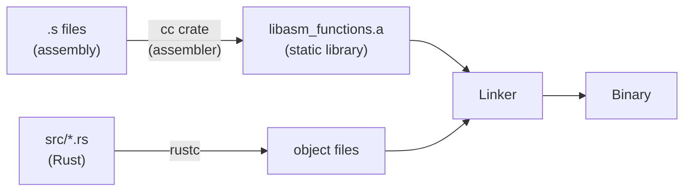
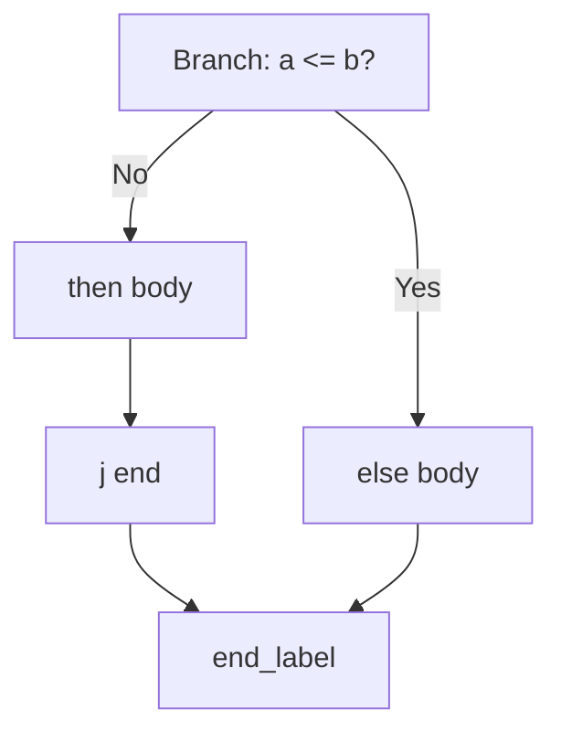
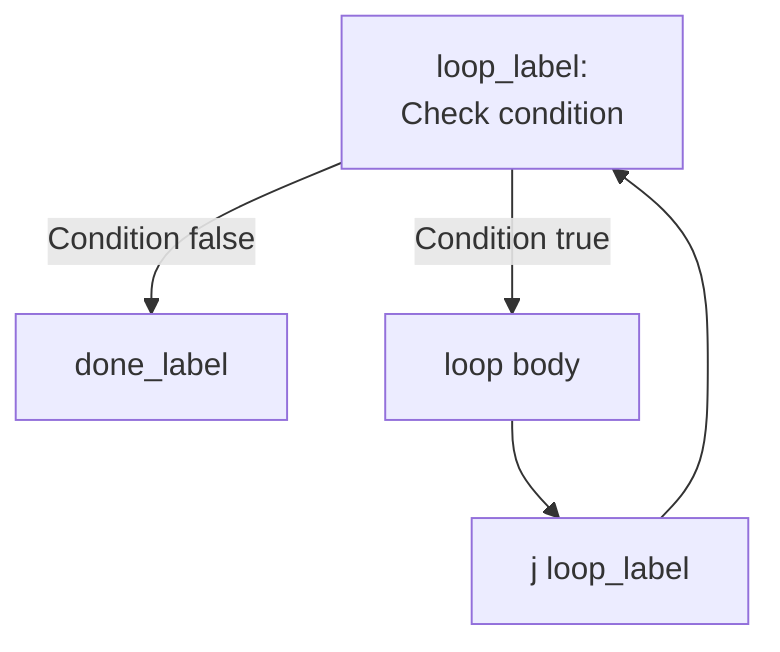

# Introduction to RISC-V Assembly

## Overview

This lecture introduces RISC-V assembly language programming from the perspective of a Rust programmer. RISC-V is an open-standard instruction set architecture (ISA) that provides a clean, modular design ideal for learning how processors execute code. We cover the register set, instruction syntax, data processing operations, control flow, memory access, and the interface between Rust and assembly functions. These fundamentals prepare you for Lab03, where you will implement six assembly functions called from Rust.

## Learning Objectives

- Understand what RISC-V is and why it is used for teaching
- Identify the 32 RISC-V registers by number and ABI name
- Write data processing instructions: add, sub, mul, div, shifts, bitwise ops
- Use control flow instructions: branches (beq, bne, blt, bge) and jumps
- Access memory with load and store instructions (lw, sw)
- Explain the Rust-to-assembly interface using `extern "C"`, `unsafe`, and the `cc` crate
- Write simple leaf functions in RISC-V assembly callable from Rust
- Distinguish real instructions from pseudo-instructions

## Prerequisites

- Completed project01 (NTLang parser/evaluator)
- Binary representation and bitwise operations (Week 04)
- Basic Rust programming (ownership, types, functions)
- Familiarity with the command line and Cargo build system

---

## 1. What is RISC-V?

RISC-V (pronounced "risk-five") is an **open-standard instruction set architecture** (ISA) that defines the set of instructions a processor can execute. Unlike proprietary ISAs such as x86 (Intel/AMD) or ARM, RISC-V is freely available with no licensing fees.

### Key Features

- **Open standard**: anyone can build a RISC-V processor without paying royalties
- **Modular design**: a small base integer ISA (RV32I or RV64I) plus optional extensions
- **Clean architecture**: designed from scratch in 2010 at UC Berkeley, with no legacy baggage
- **Growing adoption**: used in embedded systems, education, and increasingly in servers

### ISA Comparison

| ISA | Type | Open? | Common Uses |
| --- | --- | --- | --- |
| x86 / x86-64 | CISC | No (Intel/AMD) | Desktops, servers |
| ARM / AArch64 | RISC | Licensed | Phones, Apple Silicon |
| RISC-V | RISC | Yes (open standard) | Embedded, education, growing |

### RISC-V Extensions

The base integer ISA is extended with letter-coded modules:

| Extension | Adds |
| --- | --- |
| **I** | Base integer instructions (add, sub, branch, load/store) |
| **M** | Multiply and divide (mul, div, rem) |
| **A** | Atomic operations |
| **F** | Single-precision floating point |
| **D** | Double-precision floating point |

This course uses **RV64IM** — 64-bit base integers plus multiply/divide.

### Why Learn Assembly?

- **Understand performance**: see what the compiler actually generates
- **Debug effectively**: read disassembly output, use debuggers at the instruction level
- **Write systems software**: operating systems, compilers, and embedded code require assembly knowledge
- **Understand security**: buffer overflows, return-oriented programming, and other exploits operate at the assembly level

---

## 2. The RISC-V Register Set

RISC-V has **32 general-purpose registers**, each 64 bits wide in RV64. Every register has a hardware name (`x0`–`x31`) and an **ABI name** that describes its conventional use.

| Register | ABI Name | Usage | Preserved? |
| --- | --- | --- | --- |
| x0 | `zero` | Hardwired to zero | N/A |
| x1 | `ra` | Return address | Yes |
| x2 | `sp` | Stack pointer | Yes |
| x3 | `gp` | Global pointer | — |
| x4 | `tp` | Thread pointer | — |
| x5–x7 | `t0`–`t2` | Temporaries | No |
| x8 | `s0` / `fp` | Saved / frame pointer | Yes |
| x9 | `s1` | Saved | Yes |
| x10–x11 | `a0`–`a1` | Arguments / return value | No |
| x12–x17 | `a2`–`a7` | Arguments | No |
| x18–x27 | `s2`–`s11` | Saved | Yes |
| x28–x31 | `t3`–`t6` | Temporaries | No |

### The Zero Register

Register `x0` (`zero`) always reads as 0 and ignores writes. This is useful for building other operations:

- `addi a0, zero, 5` loads the constant 5 into `a0`
- `add a0, a1, zero` copies `a1` to `a0`
- `sub a0, zero, a1` negates `a1`

### Calling Convention

The calling convention defines how functions receive arguments and return values:

- **Arguments**: passed in `a0`–`a7` (up to 8 arguments)
- **Return value**: placed in `a0`
- **Temporary registers** (`t0`–`t6`): free to use within a function — the caller does not expect them to be preserved
- **Saved registers** (`s0`–`s11`): must be saved and restored if you use them

For Lab03

All six Lab03 functions take at most 4 arguments (in `a0`–`a3`) and return a value in `a0`. They are all **leaf functions** (they do not call other functions), so you only need temporary registers (`t0`–`t6`) for intermediate calculations. You do not need to save or restore any registers.

---

## 3. Instruction Syntax and Types

### General Format

RISC-V instructions follow the pattern:

```
opcode destination, source1, source2
```

Comments start with `#`:

```
add a0, a0, a1    # a0 = a0 + a1
```

### Data Processing Instructions

These operate on register values:

| Instruction | Meaning | Example |
| --- | --- | --- |
| `add rd, rs1, rs2` | rd = rs1 + rs2 | `add a0, a0, a1` |
| `sub rd, rs1, rs2` | rd = rs1 − rs2 | `sub a0, a0, a1` |
| `mul rd, rs1, rs2` | rd = rs1 × rs2 | `mul a0, a0, a1` |
| `div rd, rs1, rs2` | rd = rs1 / rs2 | `div a0, a0, a1` |
| `rem rd, rs1, rs2` | rd = rs1 % rs2 | `rem t0, a0, a1` |
| `and rd, rs1, rs2` | rd = rs1 & rs2 | `and a0, a0, a1` |
| `or rd, rs1, rs2` | rd = rs1 | rs2 | `or a0, a0, a1` |
| `xor rd, rs1, rs2` | rd = rs1 ^ rs2 | `xor a0, a0, a1` |
| `sll rd, rs1, rs2` | rd = rs1 << rs2 | `sll a0, a0, a1` |
| `srl rd, rs1, rs2` | rd = rs1 >> rs2 (logical) | `srl a0, a0, a1` |
| `sra rd, rs1, rs2` | rd = rs1 >> rs2 (arithmetic) | `sra a0, a0, a1` |

### Immediate Instructions

These use a constant (immediate) value instead of a second source register. The immediate is a 12-bit signed value (range: −2048 to 2047).

| Instruction | Meaning | Example |
| --- | --- | --- |
| `addi rd, rs, imm` | rd = rs + imm | `addi a0, a0, 1` |
| `andi rd, rs, imm` | rd = rs & imm | `andi a0, a0, 0xFF` |
| `ori rd, rs, imm` | rd = rs | imm | `ori a0, a0, 1` |
| `xori rd, rs, imm` | rd = rs ^ imm | `xori a0, a0, -1` |
| `slli rd, rs, imm` | rd = rs << imm | `slli a0, a0, 2` |
| `srli rd, rs, imm` | rd = rs >> imm (logical) | `srli a0, a0, 4` |
| `srai rd, rs, imm` | rd = rs >> imm (arithmetic) | `srai a0, a0, 4` |

No `subi` instruction

RISC-V does not have a subtract-immediate instruction. Use `addi` with a negative value instead: `addi a0, a0, -1` subtracts 1 from `a0`.

---

## 4. Pseudo-Instructions

Pseudo-instructions are assembler conveniences that expand to one or more real instructions. They make assembly code more readable.

| Pseudo-Instruction | Expansion | Meaning |
| --- | --- | --- |
| `li rd, imm` | `addi rd, zero, imm` (small) | Load immediate value into rd |
| `mv rd, rs` | `addi rd, rs, 0` | Copy register rs to rd |
| `not rd, rs` | `xori rd, rs, -1` | Bitwise NOT |
| `neg rd, rs` | `sub rd, zero, rs` | Negate (two's complement) |
| `j label` | `jal zero, label` | Unconditional jump |
| `ret` | `jalr zero, ra, 0` | Return to caller |
| `nop` | `addi zero, zero, 0` | No operation |
| `ble rs1, rs2, label` | `bge rs2, rs1, label` | Branch if rs1 ≤ rs2 |
| `bgt rs1, rs2, label` | `blt rs2, rs1, label` | Branch if rs1 > rs2 |

The most important pseudo-instructions for Lab03 are `li` (load a constant), `mv` (copy a register), `j` (jump), and `ret` (return).

---

## 5. Assembly File Structure and the Rust Interface

### Assembly File Format

A RISC-V assembly file (`.s` extension) contains directives, labels, and instructions:

```
.global function_name

function_name:
    # instructions here
    ret
```

- **`.global function_name`** makes the label visible to the linker, allowing Rust to call it
- **`function_name:`** is a label marking the start of the function
- **`ret`** returns control to the caller

### The Rust Side

Rust calls assembly functions using `extern "C"` declarations and `unsafe` blocks:

```
extern "C" {
    fn add3_s(a: i32, b: i32, c: i32) -> i32;
}

fn main() {
    let result = unsafe { add3_s(1, 2, 3) };
    println!("Result: {}", result);
}
```

- **`extern "C"`** tells Rust this function uses the C calling convention (arguments in `a0`–`a7`, return in `a0`)
- **`unsafe`** is required because Rust cannot verify the safety of foreign function calls
- The function name in Rust must match the `.global` label in the assembly file

### The Build Pipeline

The `cc` crate compiles assembly files into a static library that Rust links against:



### build.rs

The `build.rs` file tells Cargo how to compile the assembly:

```
fn main() {
    cc::Build::new()
        .file("asm/first_s.s")
        .file("asm/add1_s.s")
        .file("asm/add3_s.s")
        .file("asm/add3arr_s.s")
        .file("asm/ifelse_s.s")
        .file("asm/loop_s.s")
        .compile("asm_functions");

    println!("cargo:rerun-if-changed=asm/first_s.s");
    println!("cargo:rerun-if-changed=asm/add1_s.s");
    println!("cargo:rerun-if-changed=asm/add3_s.s");
    println!("cargo:rerun-if-changed=asm/add3arr_s.s");
    println!("cargo:rerun-if-changed=asm/ifelse_s.s");
    println!("cargo:rerun-if-changed=asm/loop_s.s");
}
```

- `cc::Build::new()` creates a build configuration
- `.file(...)` adds each assembly file
- `.compile("asm_functions")` compiles them into a static library called `asm_functions`
- `cargo:rerun-if-changed=...` tells Cargo to rebuild when assembly files change

### Cargo.toml

The project depends on the `cc` crate as a build dependency:

```
[package]
name = "week05"
version = "0.1.0"
edition = "2021"

[build-dependencies]
cc = "1"

[[bin]]
name = "first"
path = "src/bin/first.rs"
```

Each `[[bin]]` section defines a separate binary that can be run with `cargo run --bin <name>`.

---

## 6. In-Class Examples

These six examples progressively introduce RISC-V assembly concepts. Each shows the Rust caller and the assembly implementation.

### Example 1: `first_s` — No Arguments, Return a Constant

The simplest possible function: computes `3 + 99` and returns the result.

**Rust** (`src/bin/first.rs`):

```
extern "C" {
    fn first_s() -> i32;
}

fn first_rust() -> i32 {
    let x = 3;
    let y = 99;
    x + y
}

fn main() {
    let r = first_rust();
    println!("first_rust() = {}", r);

    let r = unsafe { first_s() };
    println!("first_s() = {}", r);
}
```

**Assembly** (`asm/first_s.s`):

```
.global first_s

# first_s adds 3 + 99 and returns the result
first_s:
    li t0, 3        # t0 = 3
    li t1, 99       # t1 = 99
    add a0, t0, t1  # a0 = t0 + t1 (return value goes in a0)
    ret
```

**Concepts introduced**: `.global` directive, `li` (load immediate), `add`, return value in `a0`, `ret`.

### Example 2: `add1_s` — One Argument

Receives one argument and adds 1 to it.

**Rust** (`src/bin/add1.rs`):

```
extern "C" {
    fn add1_s(a: i32) -> i32;
}

fn add1_rust(a: i32) -> i32 {
    a + 1
}
```

**Assembly** (`asm/add1_s.s`):

```
.global add1_s

# int a - a0

add1_s:
    addi a0, a0, 1
    # The return value goes in a0
    ret
```

**Concepts introduced**: argument arrives in `a0`, `addi` (add immediate).

### Example 3: `add3_s` — Multiple Arguments

Adds three arguments together. Demonstrates that `add` only takes two source registers, so multiple additions must be chained.

**Rust** (`src/bin/add3.rs`):

```
extern "C" {
    fn add3_s(a: i32, b: i32, c: i32) -> i32;
}

fn add3_rust(a: i32, b: i32, c: i32) -> i32 {
    a + b + c
}
```

**Assembly** (`asm/add3_s.s`):

```
.global add3_s

# a0 - int a
# a1 - int b
# a2 - int c

add3_s:
    # The add instruction can only add two registers
    add a0, a0, a1   # a = a + b
    add a0, a0, a2   # a = a + c
    ret
```

**Concepts introduced**: multiple arguments in `a0`, `a1`, `a2`; sequential operations; accumulating into `a0`.

### Example 4: `add3arr_s` — Array Access via Pointer

Receives a pointer to an array of three integers and returns their sum. Introduces memory access with `lw`.

**Rust** (`src/bin/add3arr.rs`):

```
extern "C" {
    fn add3arr_s(arr: *const i32) -> i32;
}

fn add3arr_rust(arr: &[i32; 3]) -> i32 {
    arr[0] + arr[1] + arr[2]
}
```

**Assembly** (`asm/add3arr_s.s`):

```
.global add3arr_s

# Arguments
# a0 - int arr[] (address)

# Registers
# t0 - int sum
# t1 - int tmp

add3arr_s:
    lw t0, (a0)      # t0 = *a0 (get value from memory at addr a0)
    addi a0, a0, 4   # make a0 point to the next element in arr
    lw t1, (a0)      # t1 = *a0 (get arr[1])
    add t0, t0, t1   # t0 = t0 + t1 (sum = sum + tmp)
    addi a0, a0, 4   # go to next element in arr
    lw t1, (a0)      # t1 = *a0 (get arr[2])
    add t0, t0, t1   # t0 = t0 + t1 (sum = sum + tmp)
    mv a0, t0        # a0 = t0 (return sum in a0)
    ret
```

**Concepts introduced**:

- `lw` (load word) reads a 32-bit value from memory into a register
- `(a0)` is shorthand for `0(a0)` — the memory address stored in `a0`
- `addi a0, a0, 4` advances the pointer by 4 bytes (one `i32`)
- `mv` copies a value between registers
- Temporary registers `t0`, `t1` hold intermediate values

### Example 5: `ifelse_s` — Conditional Branching

Returns 1 if the argument is positive, 0 otherwise. Introduces branch instructions.

**Rust** (`src/bin/ifelse.rs`):

```
extern "C" {
    fn ifelse_s(val: i32) -> i32;
}

fn ifelse_rust(val: i32) -> i32 {
    if val > 0 {
        1
    } else {
        0
    }
}
```

**Assembly** (`asm/ifelse_s.s`):

```
.global ifelse_s

# a0 - val    (argument)
# t0 - retval

ifelse_s:
    # if (val > 0) {
    # We need to reverse the notion of the condition
    # to branch if val <= 0
    ble a0, zero, else   # is a0 <= 0? If so branch to else label
    li t0, 1             # t0 = 1
    j done               # jump to done label
else:
    li t0, 0             # t0 = 0
    # Here we just fall through to the mv instruction
done:
    mv a0, t0            # a0 = t0 (return value in a0)
    ret
```

**Concepts introduced**:

- `ble` (branch if less-or-equal) — a pseudo-instruction for conditional branching
- **Branch on the inverse condition**: to implement `if (val > 0)`, we branch when `val <= 0` to skip the then-block
- Labels (`else:`, `done:`) mark jump targets
- `j` (jump) for unconditional jumps

### Example 6: `loop_s` — Loops

Sums all integers from 0 to n−1 using a loop.

**Rust** (`src/bin/loop.rs`):

```
extern "C" {
    fn loop_s(n: i32) -> i32;
}

fn loop_rust(n: i32) -> i32 {
    let mut sum = 0;
    for i in 0..n {
        sum += i;
    }
    sum
}
```

**Assembly** (`asm/loop_s.s`):

```
.global loop_s

# Arguments
# a0 - int n

# Register usage
# t0 - int i
# t1 - int sum

loop_s:
    li t0, 0          # t0 = 0 (i = 0)
    li t1, 0          # t1 = 0 (sum = 0)

loop:
    bge t0, a0, done  # if t0 >= a0 branch to done label
    add t1, t1, t0    # t1 = t1 + t0 (sum = sum + i)
    addi t0, t0, 1    # t0 = t0 + 1 (i = i + 1)
    j loop            # jump to loop label to repeat loop
done:
    mv a0, t1         # a0 = t1 (return value in a0)
    ret
```

**Concepts introduced**:

- Loop initialization with `li` (set counter and accumulator to 0)
- `bge` (branch if greater-or-equal) for the loop exit condition
- `addi` increments the loop counter
- `j` jumps back to the loop start
- Accumulation pattern: `add t1, t1, t0` (sum += i)

---

## 7. Control Flow Patterns

Translating high-level control flow to assembly follows predictable patterns.

### If/Else Pattern

The key insight is to **branch on the inverse condition** — skip the then-block when the condition is false:

```
Rust:                         Assembly:

if a > b {                    ble a, b, else_label   # inverse: a <= b
    // then body                  # then body
} else {                      j end_label
    // else body              else_label:
}                                 # else body
                              end_label:
```



### Branch Instructions

| Instruction | Condition | Meaning |
| --- | --- | --- |
| `beq rs1, rs2, label` | rs1 == rs2 | Branch if equal |
| `bne rs1, rs2, label` | rs1 != rs2 | Branch if not equal |
| `blt rs1, rs2, label` | rs1 < rs2 | Branch if less than |
| `bge rs1, rs2, label` | rs1 >= rs2 | Branch if greater or equal |
| `ble rs1, rs2, label` | rs1 <= rs2 | Branch if less or equal (pseudo) |
| `bgt rs1, rs2, label` | rs1 > rs2 | Branch if greater than (pseudo) |

### Condition Inversion Table

When translating `if (condition)`, branch on the **opposite** to skip the then-block:

| Rust Condition | Assembly Branch (skip then-block) |
| --- | --- |
| `a == b` | `bne a, b, else` |
| `a != b` | `beq a, b, else` |
| `a < b` | `bge a, b, else` |
| `a >= b` | `blt a, b, else` |
| `a > b` | `ble a, b, else` |
| `a <= b` | `bgt a, b, else` |

### While Loop Pattern

```
Rust:                         Assembly:

while condition {         loop_label:
    body                      branch_if_NOT_condition done_label
}                             # body
                              j loop_label
                          done_label:
```



---

## 8. Memory Access — Load and Store

RISC-V is a **load/store architecture**: arithmetic instructions operate only on registers. To work with data in memory, you must first **load** it into a register, operate on it, then **store** the result back.

### Load Instructions

| Instruction | Bytes Loaded | Sign Extension | Use For |
| --- | --- | --- | --- |
| `lb rd, offset(rs)` | 1 | Sign-extend | `i8` |
| `lbu rd, offset(rs)` | 1 | Zero-extend | `u8` |
| `lh rd, offset(rs)` | 2 | Sign-extend | `i16` |
| `lhu rd, offset(rs)` | 2 | Zero-extend | `u16` |
| `lw rd, offset(rs)` | 4 | Sign-extend | `i32` |
| `lwu rd, offset(rs)` | 4 | Zero-extend | `u32` |
| `ld rd, offset(rs)` | 8 | — | `i64` / pointers |

### Store Instructions

| Instruction | Bytes Stored | Use For |
| --- | --- | --- |
| `sb rs2, offset(rs1)` | 1 | `i8` / `u8` |
| `sh rs2, offset(rs1)` | 2 | `i16` / `u16` |
| `sw rs2, offset(rs1)` | 4 | `i32` / `u32` |
| `sd rs2, offset(rs1)` | 8 | `i64` / pointers |

### Addressing Syntax

The syntax `offset(base)` computes the memory address as `base + offset`:

```
lw t0, 0(a0)    # load word at address a0 + 0
lw t1, 4(a0)    # load word at address a0 + 4
lw t2, 8(a0)    # load word at address a0 + 8
```

When the offset is 0, you can write `(a0)` instead of `0(a0)`.

### Array Indexing

Arrays are stored contiguously in memory. The address of element `i` is:

\[\text{address} = \text{base} + i \times \text{sizeof(element)}\]

For an array of `i32` values (4 bytes each):

| Element | Offset | Address |
| --- | --- | --- |
| `arr[0]` | 0 | `base + 0` |
| `arr[1]` | 4 | `base + 4` |
| `arr[2]` | 8 | `base + 8` |
| `arr[3]` | 12 | `base + 12` |

Two ways to compute the offset for element `i`:

1. **Multiplication**: `mul t0, i, 4` then `add t0, base, t0`
2. **Shift** (more efficient): `slli t0, i, 2` then `add t0, base, t0`

Shifting left by 2 bits multiplies by 4 (\(2^2 = 4\)), which gives the byte offset for `i32` arrays.

Lab03: findmax

The `findmax` function receives a pointer to an `i32` array in `a0` and the array length in `a1`. Use `lw` to load 4-byte elements. You can either use offsets (`lw t0, 0(a0)`, `lw t0, 4(a0)`, ...) or increment the pointer by 4 after each load (`addi a0, a0, 4`).

---

## Key Concepts

| Concept | Description |
| --- | --- |
| RISC-V | Open-standard RISC instruction set architecture |
| Register | Fast on-chip storage; 32 registers, 64 bits each in RV64 |
| ABI names | Conventional names (`a0`–`a7`, `t0`–`t6`, `s0`–`s11`) that define register usage |
| Calling convention | Arguments in `a0`–`a7`, return value in `a0`, temporaries are caller-saved |
| `extern "C"` | Rust declaration for functions using the C calling convention |
| `cc` crate | Cargo build dependency that compiles `.s` files into linkable object code |
| Pseudo-instruction | Assembler shorthand (`li`, `mv`, `ret`, `j`) that expands to real instructions |
| Load/Store | Memory access pattern: data must be loaded into registers before use |
| Branch | Conditional jump based on comparing two registers |
| Label | Named address in assembly, used as branch and jump targets |

---

## Practice Problems

### Problem 1: Register Identification

A Rust function is declared as:

```
extern "C" {
    fn foo_s(x: i32, y: i32, z: i32) -> i32;
}
```

Which registers hold `x`, `y`, and `z` on entry to `foo_s`? Which register holds the return value?

> **Click to reveal solution**
>
> - `x` → `a0`
> - `y` → `a1`
> - `z` → `a2`
> - Return value → `a0`
> The first argument maps to `a0`, the second to `a1`, the third to `a2`, and so on. The return value is always placed in `a0`.

### Problem 2: add4

Write the RISC-V assembly for `add4_s(a, b, c, d)` that returns `a + b + c + d`.

Rust reference:

```
fn add4_rust(a: i32, b: i32, c: i32, d: i32) -> i32 {
    a + b + c + d
}
```

> **Click to reveal solution**
>
> ```
> .global add4_s
> 
> add4_s:
>     add a0, a0, a1    # a0 = a + b
>     add a0, a0, a2    # a0 = a + b + c
>     add a0, a0, a3    # a0 = a + b + c + d
>     ret
> ```
> 
> This extends the `add3\_s` pattern with one more `add` for the fourth argument in `a3`.

### Problem 3: quadratic

Write the RISC-V assembly for `quadratic_s(x, a, b, c)` that returns `a*x*x + b*x + c`.

Rust reference:

```
fn quadratic_rust(x: i32, a: i32, b: i32, c: i32) -> i32 {
    a * x * x + b * x + c
}
```

> **Click to reveal solution**
>
> ```
> .global quadratic_s
> 
> # a0 - x, a1 - a, a2 - b, a3 - c
> 
> quadratic_s:
>     mul t0, a0, a0    # t0 = x * x
>     mul t0, a1, t0    # t0 = a * x * x
>     mul t1, a2, a0    # t1 = b * x
>     add a0, t0, t1    # a0 = a*x*x + b*x
>     add a0, a0, a3    # a0 = a*x*x + b*x + c
>     ret
> ```
> 
> Use temporary registers `t0` and `t1` to hold intermediate results. Compute `x²` first, then multiply by `a`, then compute `b\*x`, and finally add all terms together.

### Problem 4: min

Write the RISC-V assembly for `min_s(a, b)` that returns the smaller of the two values.

Rust reference:

```
fn min_rust(a: i32, b: i32) -> i32 {
    if a <= b { a } else { b }
}
```

> **Click to reveal solution**
>
> ```
> .global min_s
> 
> min_s:
>     ble a0, a1, done   # if a <= b, a0 already holds the answer
>     mv a0, a1          # else: a0 = b
> done:
>     ret
> ```
> 
> If `a <= b`, `a` is already in `a0` (the return register), so we skip to `done`. Otherwise, we copy `b` from `a1` to `a0`.

### Problem 5: grade

Write the RISC-V assembly for `grade_s(score)` that maps a score (0–100) to a letter grade value: 90+ → 4 (A), 80+ → 3 (B), 70+ → 2 (C), 60+ → 1 (D), otherwise → 0 (F).

Rust reference:

```
fn grade_rust(score: i32) -> i32 {
    if score >= 90 { 4 }
    else if score >= 80 { 3 }
    else if score >= 70 { 2 }
    else if score >= 60 { 1 }
    else { 0 }
}
```

> **Click to reveal solution**
>
> ```
> .global grade_s
> 
> # a0 - score
> 
> grade_s:
>     li t0, 90
>     bge a0, t0, grade_a
>     li t0, 80
>     bge a0, t0, grade_b
>     li t0, 70
>     bge a0, t0, grade_rust
>     li t0, 60
>     bge a0, t0, grade_d
>     li a0, 0            # F
>     ret
> grade_a:
>     li a0, 4
>     ret
> grade_b:
>     li a0, 3
>     ret
> grade_rust:
>     li a0, 2
>     ret
> grade_d:
>     li a0, 1
>     ret
> ```
> 
> Check each threshold from highest to lowest using `bge` (branch if greater-or-equal). When a condition matches, branch to the corresponding label, load the grade value into `a0`, and return. If no threshold matches, the default case (F = 0) falls through.

### Problem 6: sum\_to\_n

Write the RISC-V assembly for `sum_to_n_s(n)` that returns the sum of integers from 1 to n.

Rust reference:

```
fn sum_to_n_rust(n: i32) -> i32 {
    let mut sum = 0;
    let mut i = 1;
    while i <= n {
        sum += i;
        i += 1;
    }
    sum
}
```

> **Click to reveal solution**
>
> ```
> .global sum_to_n_s
> 
> # a0 - n
> 
> # Register usage
> # t0 - int i
> # t1 - int sum
> 
> sum_to_n_s:
>     li t0, 1            # i = 1
>     li t1, 0            # sum = 0
> loop:
>     bgt t0, a0, done    # if i > n, exit loop
>     add t1, t1, t0      # sum += i
>     addi t0, t0, 1      # i++
>     j loop
> done:
>     mv a0, t1           # return sum
>     ret
> ```
> 
> This follows the same loop pattern as `loop\_s`, but starts `i` at 1 and uses `bgt` (branch if greater-than) for the exit condition to implement `while i <= n`.

---

## Further Reading

- [RISC-V ISA Specification](https://riscv.org/technical/specifications/) — official standard
- [RISC-V Assembly Programmer's Manual](https://github.com/riscv-non-isa/riscv-asm-manual/blob/main/riscv-asm.md) — practical assembly reference
- [The RISC-V Reader](http://www.riscvbook.com/) — Patterson & Waterman textbook
- [Lab03: Introduction to RISC-V Assembly Programming](../../assignments/lab03/) — the assignment these notes prepare you for

---

## Summary

1. **RISC-V** is an open-standard RISC instruction set architecture with a clean, modular design. This course uses RV64IM (64-bit base plus multiply/divide).
2. **32 registers** are identified by ABI names: `a0`–`a7` for arguments and return values, `t0`–`t6` for temporaries, `s0`–`s11` for saved values, and the special `zero` register hardwired to 0.
3. **Instruction format** follows `opcode destination, source1, source2`. Immediate variants replace the second source with a constant.
4. **Pseudo-instructions** like `li`, `mv`, `ret`, and `j` are assembler conveniences that expand to real instructions, making assembly code more readable.
5. **The Rust-assembly interface** uses `extern "C"` to declare foreign functions, `unsafe` blocks to call them, and the `cc` crate in `build.rs` to compile `.s` files into a linkable static library.
6. **Control flow** uses conditional branches (`beq`, `bne`, `blt`, `bge`) and unconditional jumps (`j`). The key pattern is to **branch on the inverse condition** to skip the then-block.
7. **Memory access** uses load (`lw`, `ld`) and store (`sw`, `sd`) instructions. Array elements are accessed by computing `base + index * sizeof(element)`.
8. **Lab03** requires implementing six leaf functions in RISC-V assembly. All six use only argument registers (`a0`–`a3`), temporary registers (`t0`–`t6`), and the return register (`a0`) — no stack management is needed.