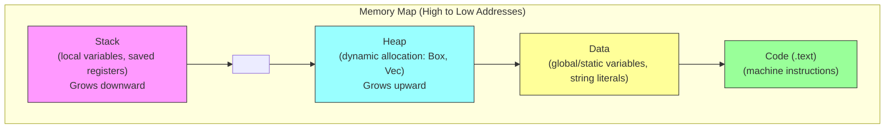
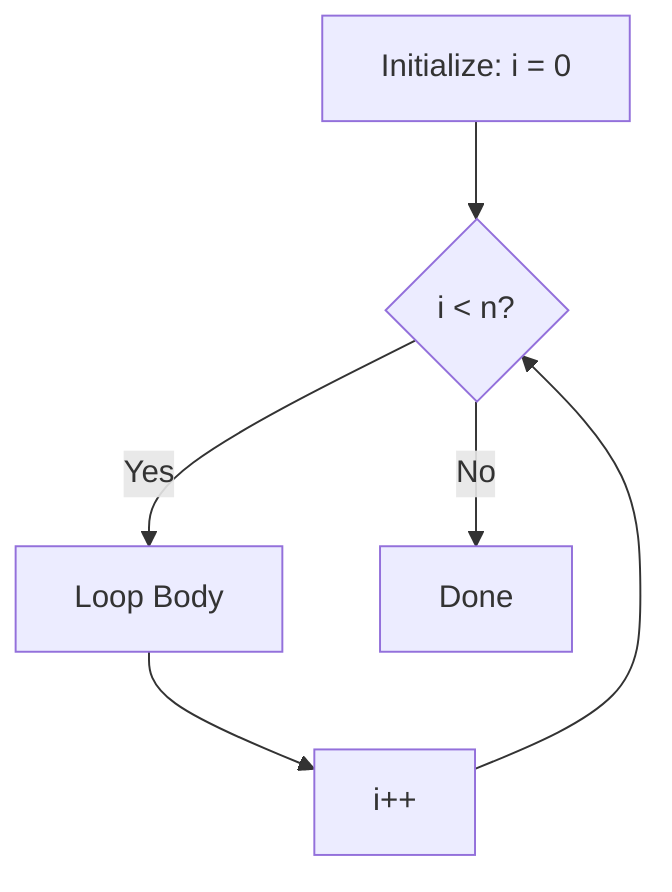

# RISC-V Assembly 2

## Overview

This lecture continues our exploration of RISC-V assembly programming, building on the foundations from Lecture 05. We dive deeper into memory operations with different data sizes, array access patterns, and the program memory layout. We expand our understanding of control flow with more branching patterns and loop structures, and introduce the distinction between leaf and non-leaf functions. These concepts are essential for Lab03 and prepare you for more complex assembly programming.

## Learning Objectives

- Use load and store instructions with different data sizes (byte, halfword, word, doubleword)
- Understand sign extension vs zero extension when loading smaller values
- Implement array indexing and traversal in assembly
- Describe the program memory layout (stack, heap, data, code)
- Translate if/else statements and loops to assembly using systematic patterns
- Distinguish leaf functions from non-leaf functions
- Explain why non-leaf functions must save and restore the return address

## Prerequisites

- RISC-V Assembly 1 (Lecture 05): registers, instructions, calling convention, basic control flow
- Binary representation and bitwise operations (Week 04)
- Lab03 in progress

---

## 1. Memory Operations

### Memory Organization

Memory in RISC-V is **byte-addressable** — each byte has a unique address. Data comes in several sizes:

| Data Size | Bytes | Load / Store | Rust Type |
| --- | --- | --- | --- |
| Byte | 1 | `lb` / `sb` | `i8`, `u8` |
| Halfword | 2 | `lh` / `sh` | `i16`, `u16` |
| Word | 4 | `lw` / `sw` | `i32`, `u32` |
| Doubleword | 8 | `ld` / `sd` | `i64`, `u64`, pointers |

### Load Instructions

Load instructions read data from memory into a register. On RV64, all values are placed into 64-bit registers, so smaller values must be **extended**:

| Instruction | Bytes | Extension | Use For |
| --- | --- | --- | --- |
| `lb rd, offset(rs)` | 1 | Sign-extend | `i8` |
| `lbu rd, offset(rs)` | 1 | Zero-extend | `u8` |
| `lh rd, offset(rs)` | 2 | Sign-extend | `i16` |
| `lhu rd, offset(rs)` | 2 | Zero-extend | `u16` |
| `lw rd, offset(rs)` | 4 | Sign-extend | `i32` |
| `lwu rd, offset(rs)` | 4 | Zero-extend | `u32` |
| `ld rd, offset(rs)` | 8 | — | `i64` / pointers |

Sign Extension vs Zero Extension

When loading a byte value of `0xFF` (255 unsigned, −1 signed):

- `lb` sign-extends: the register gets `0xFFFFFFFFFFFFFFFF` (−1 as `i64`)
- `lbu` zero-extends: the register gets `0x00000000000000FF` (255 as `i64`)

Use the signed version (`lb`, `lh`, `lw`) for signed types and the unsigned version (`lbu`, `lhu`, `lwu`) for unsigned types.

### Store Instructions

Store instructions write data from a register to memory. Stores do not need sign/zero extension — they simply write the low bytes of the register:

| Instruction | Bytes Stored | Use For |
| --- | --- | --- |
| `sb rs2, offset(rs1)` | 1 | `i8` / `u8` |
| `sh rs2, offset(rs1)` | 2 | `i16` / `u16` |
| `sw rs2, offset(rs1)` | 4 | `i32` / `u32` |
| `sd rs2, offset(rs1)` | 8 | `i64` / pointers |

### Load vs Store Operand Order

Notice the operand order differs between loads and stores:

```
# Load: DESTINATION register first
lw  t0, (a0)        # t0 = memory[a0]  — t0 receives the value

# Store: SOURCE register first
sw  t0, (a0)        # memory[a0] = t0  — t0 provides the value
```

This is a common source of confusion. In loads, the destination register comes first (consistent with other instructions like `add rd, rs1, rs2`). In stores, the value to be stored comes first.

### Addressing Syntax: `offset(base)`

The syntax `offset(base)` computes the memory address as `base + offset`:

```
lw t0, 0(a0)    # load from address a0 + 0
lw t1, 4(a0)    # load from address a0 + 4
lw t2, 8(a0)    # load from address a0 + 8
```

When the offset is 0, you can write `(a0)` instead of `0(a0)`.

```
Memory
Address      Content
+---------+
a0 + 8   |  value3  |  <- lw t2, 8(a0)
+---------+
a0 + 4   |  value2  |  <- lw t1, 4(a0)
+---------+
a0       |  value1  |  <- lw t0, (a0)
+---------+
```

### Rust Pointer Operations in Assembly

Rust raw pointer operations map directly to load and store instructions:

```
// Rust raw pointer operations (unsafe)
let p: *mut i32 = /* address */;
let x: i32 = unsafe { *p };     // Load from memory
unsafe { *p = x; }              // Store to memory
```

```
# Assembly equivalent (a0 = p, t0 = x)
lw  t0, (a0)        # x = *p  (load)
sw  t0, (a0)        # *p = x  (store)
```

---

## 2. Arrays and Indexing

### Array Layout in Memory

Arrays are stored contiguously in memory. For an `i32` array `[3, 4, 5, 6]`:

```
Memory Layout for arr: [i32; 4] = [3, 4, 5, 6]

Address      Index    Value
+---------+
arr + 12 |    6    |    <- arr[3]
+---------+
arr + 8  |    5    |    <- arr[2]
+---------+
arr + 4  |    4    |    <- arr[1]
+---------+
arr      |    3    |    <- arr[0]
+---------+
```

### Computing Element Addresses

To access `arr[i]`, compute: **address = base + (i × sizeof(element))**

For an `i32` array (4 bytes per element): `address = arr + (i × 4)`

| Element | Offset | Address |
| --- | --- | --- |
| `arr[0]` | 0 | `base + 0` |
| `arr[1]` | 4 | `base + 4` |
| `arr[2]` | 8 | `base + 8` |
| `arr[3]` | 12 | `base + 12` |

Two ways to compute the byte offset:

**Method 1: Multiplication**

```
li   t0, 4           # t0 = sizeof(i32)
mul  t0, a1, t0      # t0 = i * 4
add  t0, a0, t0      # t0 = &arr[i]
lw   t1, (t0)        # t1 = arr[i]
```

**Method 2: Shift (more efficient)**

```
slli t0, a1, 2       # t0 = i * 4  (shift left by 2 = multiply by 4)
add  t0, a0, t0      # t0 = &arr[i]
lw   t1, (t0)        # t1 = arr[i]
```

Shifting left by N bits multiplies by \(2^N\):

| Shift Amount | Multiplier | Use For |
| --- | --- | --- |
| `slli x, y, 1` | × 2 | `i16` arrays |
| `slli x, y, 2` | × 4 | `i32` arrays |
| `slli x, y, 3` | × 8 | `i64` / pointer arrays |

### Complete Example: `sum_array`

This function sums all elements of an `i32` array, demonstrating array traversal with indexing.

**Rust** (`src/bin/sum_array.rs`):

```
extern "C" {
    fn sum_array_s(arr: *const i32, len: i32) -> i32;
}

fn sum_array_rust(arr: *const i32, len: i32) -> i32 {
    let mut sum = 0;
    for i in 0..len {
        sum += unsafe { *arr.offset(i as isize) };
    }
    sum
}
```

**Assembly** (`asm/sum_array_s.s`):

```
.global sum_array_s

# int sum_array_s(int *arr, int len)
# a0 = arr (base address)
# a1 = len (number of elements)

# Register usage:
# t0 = sum
# t1 = i (loop counter)
# t2 = scratch (byte offset, address)
# t3 = scratch (loaded value)

sum_array_s:
    li   t0, 0              # sum = 0
    li   t1, 0              # i = 0

sum_loop:
    bge  t1, a1, sum_done   # if i >= len, exit loop

    slli t2, t1, 2          # t2 = i * 4 (byte offset)
    add  t2, a0, t2         # t2 = &arr[i]
    lw   t3, (t2)           # t3 = arr[i]
    add  t0, t0, t3         # sum += arr[i]

    addi t1, t1, 1          # i++
    j    sum_loop           # repeat

sum_done:
    mv   a0, t0             # return sum
    ret
```

**Step-by-step for a 3-element array `[10, 20, 30]`**:

| Iteration | `t1` (i) | `t2` (offset) | `t2` (address) | `t3` (value) | `t0` (sum) |
| --- | --- | --- | --- | --- | --- |
| 1 | 0 | 0 | arr+0 | 10 | 10 |
| 2 | 1 | 4 | arr+4 | 20 | 30 |
| 3 | 2 | 8 | arr+8 | 30 | 60 |

Lab03: findmax

The `findmax` function uses the same array traversal pattern as `sum_array`. Instead of accumulating a sum, track the maximum value seen so far and compare each element with `bge` or `blt`.

---

## 3. Memory Layout

### Program Memory Regions

A running program's memory is organized into distinct regions:



### The Stack

The **stack** stores local variables, saved registers, and return addresses for function calls.

Key properties:

- `sp` (stack pointer) points to the top of the stack
- The stack grows **downward** (toward lower addresses)
- **Allocate** space by subtracting from `sp`
- **Deallocate** by adding to `sp`

```
# Allocate 16 bytes on the stack
addi sp, sp, -16

# Use the stack space
sw   t0, 0(sp)      # store t0 at sp + 0
sw   t1, 4(sp)      # store t1 at sp + 4
sd   ra, 8(sp)      # store ra at sp + 8 (8 bytes for address)

# ... do work ...

# Restore values
lw   t0, 0(sp)
lw   t1, 4(sp)
ld   ra, 8(sp)

# Deallocate stack space
addi sp, sp, 16
```

Stack Alignment

The RISC-V calling convention requires `sp` to be aligned to 16 bytes. Always allocate stack space in multiples of 16.

### Data Regions

Assembly files can declare data using directives:

```
.data                          # switch to data section
message:
    .string "Hello, World!"    # null-terminated string

count:
    .word 42                   # 32-bit integer

.text                          # switch to code section
    la   a0, message           # load ADDRESS of message into a0
    lw   t0, count             # load VALUE of count into t0
```

- **`.data`** directive: declares what follows as data (goes in the data section)
- **`.text`** directive: declares what follows as code (goes in the code section)
- **`la`** (load address): a pseudo-instruction that loads the address of a label into a register

---

## 4. Control Flow: If/Else

### Branch Instructions

Lecture 05 introduced the basic branch instructions. Here is the complete set, including **unsigned** comparisons:

| Instruction | Condition | Signed/Unsigned |
| --- | --- | --- |
| `beq rs1, rs2, label` | rs1 == rs2 | — |
| `bne rs1, rs2, label` | rs1 != rs2 | — |
| `blt rs1, rs2, label` | rs1 < rs2 | Signed |
| `bge rs1, rs2, label` | rs1 >= rs2 | Signed |
| `bltu rs1, rs2, label` | rs1 < rs2 | Unsigned |
| `bgeu rs1, rs2, label` | rs1 >= rs2 | Unsigned |
| `ble rs1, rs2, label` | rs1 <= rs2 | Pseudo (signed) |
| `bgt rs1, rs2, label` | rs1 > rs2 | Pseudo (signed) |

Signed vs Unsigned Branches

Use `blt`/`bge` for signed comparisons (`i32`, `i64`) and `bltu`/`bgeu` for unsigned comparisons (`u32`, `u64`). The difference matters when values can be interpreted differently — for example, the bit pattern `0xFFFFFFFF` is −1 as signed but 4,294,967,295 as unsigned.

### Condition Inversion Pattern

Recall from Lecture 05: to implement `if (condition)`, we branch on the **opposite** condition to skip the then-block:

| Rust Condition | Assembly Branch (skip then-block) |
| --- | --- |
| `a == b` | `bne a, b, else` |
| `a != b` | `beq a, b, else` |
| `a < b` | `bge a, b, else` |
| `a >= b` | `blt a, b, else` |
| `a > b` | `ble a, b, else` |
| `a <= b` | `bgt a, b, else` |

### Example: `max` Function

**Rust**:

```
extern "C" {
    fn max_s(a: i32, b: i32) -> i32;
}

fn max_rust(a: i32, b: i32) -> i32 {
    if a > b { a } else { b }
}
```

**Assembly** (`asm/max_s.s`):

```
.global max_s

# int max_s(int a, int b)
# a0 = a, a1 = b

max_s:
    ble  a0, a1, return_b   # if a <= b, return b
    # a > b: a0 already holds a
    ret

return_b:
    mv   a0, a1             # a0 = b
    ret
```

This is compact because when `a > b`, `a` is already in `a0` (the return register). We only need to act when `a <= b`, copying `b` into `a0`.

---

## 5. Control Flow: Loops

### For Loop Pattern

```
Rust:                              Assembly:

for i in 0..n {                        li   t0, 0           # i = 0
    // body                        loop:
}                                      bge  t0, a0, done    # if i >= n, exit
                                       # body
                                       addi t0, t0, 1       # i++
                                       j    loop
                                   done:
```



### While Loop Pattern

```
Rust:                              Assembly:

while x > 0 {                     while_loop:
    sum += x;                          ble  a0, zero, while_end
    x -= 1;                            add  t0, t0, a0      # sum += x
}                                      addi a0, a0, -1      # x--
                                       j    while_loop
                                   while_end:
```

### Do-While Pattern

Rust does not have a `do-while` keyword, but the pattern can be written with `loop`:

```
Rust:                              Assembly:

loop {                             do_loop:
    sum += x;                          add  t0, t0, a0      # sum += x
    x -= 1;                            addi a0, a0, -1      # x--
    if x <= 0 { break; }               bgt  a0, zero, do_loop
}
```

The do-while pattern is more efficient — the condition check is only at the **bottom** of the loop, so there is no unconditional jump (`j`) back to the top. This saves one instruction per iteration.

---

## 6. Leaf Functions

### Definition

A **leaf function** is a function that does **not** call any other functions. All six Lab03 functions are leaf functions.

Leaf functions are simple because:

- No need to save the return address (`ra`)
- No need to allocate a stack frame
- Can use all temporary registers (`t0`–`t6`) freely

### Rules for Leaf Functions

1. **Arguments** arrive in `a0`, `a1`, `a2`, ..., `a7`
2. **Return value** goes in `a0`
3. Use **temporary registers** (`t0`–`t6`) for intermediate values
4. **Do not use `s` registers** — they must be preserved across function calls
5. Return with `ret`

```
.global my_leaf_function

my_leaf_function:
    # Arguments are in a0, a1, ...
    # Use t0-t6 for scratch work
    # Put result in a0
    ret
```

Lab03

All six Lab03 functions are leaf functions. You only need argument registers (`a0`–`a3`), temporary registers (`t0`–`t6`), and the return register (`a0`). No stack management is needed.

---

## 7. Non-Leaf Functions

### The Problem

A **non-leaf function** calls other functions. This creates a problem: the `jal` (jump and link) instruction used to call a function overwrites `ra` with the return address. If our function was itself called, our original `ra` is lost.

```
# BROKEN: ra gets overwritten by the call to helper
my_function:
    # ra = return address to OUR caller
    jal  ra, helper     # OVERWRITES ra with address after this line
    # ra now points here, NOT to our caller
    ret                 # WRONG: infinite loop!
```

### The Solution: Save `ra` on the Stack

Before calling another function, save `ra` on the stack. After the call returns, restore `ra`:

```
.global my_function

my_function:
    addi sp, sp, -16    # allocate stack space
    sd   ra, 0(sp)      # save return address

    # ... do work ...
    jal  ra, helper     # call another function (overwrites ra)
    # ... use result ...

    ld   ra, 0(sp)      # restore return address
    addi sp, sp, 16     # deallocate stack space
    ret                 # returns to our original caller
```

If you also need argument registers (`a0`, `a1`) to survive across the call, save and restore them too:

```
my_function:
    addi sp, sp, -32    # allocate stack space
    sd   ra, 0(sp)      # save return address
    sd   a0, 8(sp)      # save a0 (if needed after call)
    sd   a1, 16(sp)     # save a1 (if needed after call)

    jal  ra, helper     # call helper (may clobber a0, a1)

    ld   a1, 16(sp)     # restore a1
    ld   a0, 8(sp)      # restore a0
    ld   ra, 0(sp)      # restore ra
    addi sp, sp, 32     # deallocate
    ret
```

Coming Later

Non-leaf functions will appear in later assignments. For Lab03, all functions are leaf functions — no stack management is needed.

---

## Key Concepts

| Concept | Description |
| --- | --- |
| Byte-addressable | Each byte in memory has a unique address |
| Sign extension | Extending a smaller signed value to fill a 64-bit register (e.g., `lb`, `lw`) |
| Zero extension | Extending a smaller unsigned value by filling upper bits with 0 (e.g., `lbu`, `lwu`) |
| `offset(base)` | Memory addressing syntax: effective address = base + offset |
| Array indexing | Element address = base + (index × element\_size) |
| `slli` for indexing | Shift left to multiply index by element size (\(2^N\)) — faster than `mul` |
| Condition inversion | Branch on the opposite condition to skip the then-block |
| Unsigned branches | `bltu` / `bgeu` for unsigned comparisons (different from signed `blt` / `bge`) |
| Leaf function | A function that does not call other functions — simpler register usage |
| Non-leaf function | Must save/restore `ra` on the stack before/after calling other functions |
| Stack grows down | Allocate by subtracting from `sp`, deallocate by adding |
| `.data` / `.text` | Directives to place content in data or code sections |
| `la` | Pseudo-instruction to load the address of a label into a register |

---

## Practice Problems

### Problem 1: Memory Access

What is the difference between `lw` and `ld`? When would you use each?

> **Click to reveal solution**
>
> - `lw` (load word) loads 32 bits (4 bytes) and sign-extends to 64 bits in the register
> - `ld` (load doubleword) loads 64 bits (8 bytes) — the full register width
> Use `lw` for:
> - `i32` values (consider `lwu` for `u32` to avoid sign extension)
> Use `ld` for:
> - `i64` / `u64` values
> - Pointers and references (addresses are 64 bits on RV64)
> - `usize` values

### Problem 2: Array Access

Write assembly to set `arr[5] = 100` where `arr` is an array of `i32` values with its base address in `a0`.

> **Click to reveal solution**
>
> ```
> # Method 1: computed offset
> li   t0, 100        # t0 = 100
> li   t1, 5          # t1 = 5
> slli t1, t1, 2      # t1 = 5 * 4 = 20
> add  t1, a0, t1     # t1 = &arr[5]
> sw   t0, (t1)       # arr[5] = 100
> 
> # Method 2: constant offset (simpler when index is known)
> li   t0, 100
> sw   t0, 20(a0)     # 5 * 4 = 20, store at arr + 20
> ```
> 
> When the index is a compile-time constant, you can compute the byte offset yourself and use it directly in the `sw` instruction.

### Problem 3: Translate If Statement

Translate to RISC-V assembly (assume `x` is in `a0`):

```
if x < 0 {
    x = -x;    // absolute value
}
```

> **Click to reveal solution**
>
> ```
> # a0 = x
>     bge  a0, zero, skip     # if x >= 0, skip negation
>     neg  a0, a0             # x = -x (pseudo: sub a0, zero, a0)
> skip:
> ```
> 
> We invert the condition: instead of "if x < 0", we branch on "x >= 0" to skip the body. The `neg` pseudo-instruction negates a register by subtracting it from zero.

### Problem 4: Loop Translation

Translate this countdown loop (assume `n` is in `a0`):

```
while n > 0 {
    n -= 1;
}
```

> **Click to reveal solution**
>
> ```
> # a0 = n
> countdown:
>     ble  a0, zero, done     # if n <= 0, exit
>     addi a0, a0, -1         # n -= 1
>     j    countdown
> done:
> ```
> 
> The loop condition `n > 0` is inverted to `n <= 0` for the exit branch.

### Problem 5: Minimum of Three

Write a function `min3_s(a: i32, b: i32, c: i32) -> i32` that returns the smallest of the three values.

Rust reference:

```
fn min3_rust(a: i32, b: i32, c: i32) -> i32 {
    let mut min = a;
    if b < min { min = b; }
    if c < min { min = c; }
    min
}
```

> **Click to reveal solution**
>
> ```
> .global min3_s
> 
> # int min3_s(int a, int b, int c)
> # a0 = a, a1 = b, a2 = c
> 
> min3_s:
>     # Find min(a, b) — result stays in a0
>     blt  a0, a1, check_c    # if a < b, a is candidate
>     mv   a0, a1             # else b is candidate
> 
> check_c:
>     # Compare candidate with c
>     blt  a0, a2, done       # if candidate < c, done
>     mv   a0, a2             # else c is minimum
> 
> done:
>     ret
> ```
> 
> First compare `a` and `b`, keeping the smaller in `a0`. Then compare that result with `c`. This is equivalent to `min(min(a, b), c)`.

---

## Further Reading

- [RISC-V ISA Specification](https://riscv.org/technical/specifications/) — official standard
- [RISC-V Assembly Programmer's Manual](https://github.com/riscv-non-isa/riscv-asm-manual/blob/main/riscv-asm.md) — practical assembly reference
- [The RISC-V Reader](http://www.riscvbook.com/) — Patterson & Waterman textbook
- [Lab03: Introduction to RISC-V Assembly Programming](../../assignments/lab03/) — the assignment these notes prepare you for

---

## Summary

1. **Memory operations** use load (`lb`, `lh`, `lw`, `ld`) and store (`sb`, `sh`, `sw`, `sd`) instructions with the `offset(base)` addressing syntax. Signed loads sign-extend smaller values; unsigned loads (`lbu`, `lhu`, `lwu`) zero-extend them.
2. **Array access** computes element addresses as `base + (index × sizeof(element))`. Use `slli` (shift left) for efficient multiplication by powers of 2 — shifting left by 2 multiplies by 4, perfect for `i32` arrays.
3. **Program memory** is organized into four regions: the **stack** (grows downward from high addresses, managed by `sp`), **heap** (grows upward for dynamic allocation), **data** (global variables and constants), and **code** (machine instructions).
4. **Branches** include unsigned variants (`bltu`, `bgeu`) in addition to signed (`blt`, `bge`). The condition inversion pattern — branching on the opposite condition to skip the then-block — applies to all if/else translations.
5. **Loops** (for, while, do-while) all follow the same core pattern: initialize, check condition, execute body, update, repeat. The do-while variant is slightly more efficient because the condition check is at the bottom, eliminating one jump instruction per iteration.
6. **Leaf functions** (which do not call other functions) need only use `a` and `t` registers — no stack management needed. **Non-leaf functions** must save and restore `ra` on the stack before calling other functions.